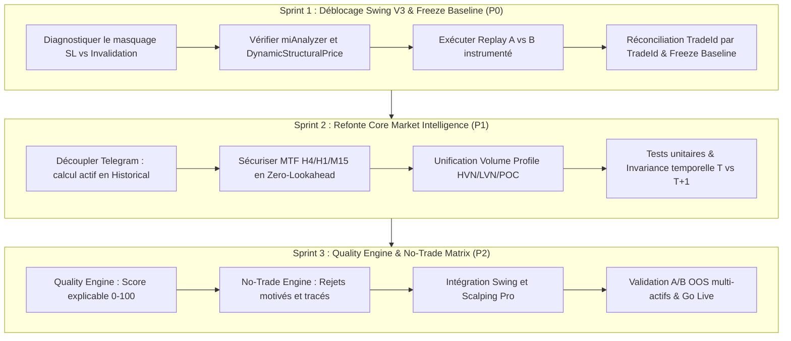

# AMC-V8 — Plan d'Action Restructuré en 3 Sprints

**Périmètre :** Market Intelligence · Market Update · Rapport H4 · HVN/LVN · Swing · Scalping Pro  
**Version :** 3.0 (Restructuration Opérationnelle)  
**Date :** Septembre 2026  

---

## 1. Vision et Architecture Cible

L'objectif est d'auditer et fiabiliser l'intelligence de marché existante, de découpler la production de données analytiques de la diffusion Telegram, et de créer un moteur de décision partagé (`Quality Engine` & `No-Trade Engine`) pour Swing et Scalping Pro, sans look-ahead ni sur-optimisation.

```text
                                MARKET INTELLIGENCE CORE
                 (H4 / H1 / M15 / M5 · Tendance · Structure SMC · Profile)
                                            │
                                            ▼
                                   UNIFIED MARKET STATE
                             (Immuable · Calculé en Historical & Realtime)
                                            │
                     ┌──────────────────────┴──────────────────────┐
                     ▼                                             ▼
             QUALITY ENGINE                                 NO-TRADE ENGINE
        (Score contextuel 0..100)                     (Rejets déterministes motivés)
                     │                                             │
                     └──────────────────────┬──────────────────────┘
                                            ▼
                                  STRATÉGIES AMC PRO
                                   /              \
                             SWING V3         SCALPING PRO
                                   \              /
                                    ▼            ▼
                                    POSITION MANAGER
                         (Exécution · SL · TP · BE · Trailing)
```

---

## 2. Principes Directeurs & Règles Absolues

1. **Régime $\neq$ Invalidation Structurelle :** La détérioration d'un indicateur de régime (ex: EMA HTF) n'est pas une rupture de structure. Un setup de retournement (`MacroReversal`) ne doit être coupé que si son ancrage structurel est brisé.
2. **Priorité absolue au Sprint 1 :** Aucune optimisation supplémentaire tant que l'incohérence entre le CSV historique et le Replay A/B (0 sorties structurelles) n'est pas résolue.
3. **Zéro Look-Ahead :** Tout calcul repose exclusivement sur des bougies clôturées (`closed-bar only`). Test d'invariance temporelle obligatoire ($T$ vs $T+1 / T+2$).
4. **Découplage strict :** L'état de marché décrit les enchères ; il n'émet pas directement de signaux d'achat/vente.
5. **Validation Empirique A/B :** Réconciliation obligatoire TradeId par TradeId. Tout changement comportemental doit être validé sur données Out-Of-Sample (OOS).

---

## 3. Découpage Opérationnel en 3 Sprints



---

## 4. Détail du Sprint 1 — Déblocage Swing V3 & Freeze Baseline

### Problématique
Dans le rapport `SWING_REPLAY_COMPARISON_A_VS_B.md`, toutes les variantes $N \in [1..6]$ affichent une performance strictement identique à la baseline (+18 442 R) avec **0 sortie structurelle**. L'invalidation n'a jamais été exercée car :
1. `miAnalyzer` était nul (`EnableMarketIntelligence = false`).
2. Dans `UpdateOpenSwingTrades()`, l'étape 3 (`Stop Loss`) s'exécute **avant** l'étape 6 (`EnableSwingRegimeInvalidation`). Or `DynamicStructuralPrice` coïncidait avec le Stop Loss. Dès que la structure rompait, le Stop Loss fermait le trade immédiatement, empêchant le compteur d'accumuler $N$ barres.

### Actions du Sprint 1
1. **Instrumenter `UpdateOpenSwingTrades()` :**
   - Tracer la distance entre `CurrentStopPrice` et `DynamicStructuralPrice`.
   - Permettre l'alimentation des pivots SMC indépendamment de l'état du bot Telegram.
2. **Clarifier le contrat de gestion :**
   - Arbitrer entre un Stop Loss physique serré sur la structure (laissant la gestion naturelle opérer) ou un Stop d'urgence large avec coupure logicielle anticipée confirmée.
3. **Rejouer et réconcilier :**
   - Rejouer l'échantillon des 1 047 trades H1 2026.
   - Fournir la table de réconciliation TradeId par TradeId.
   - Figer la baseline officielle.

---

## 5. Détail du Sprint 2 — Refonte Core Market Intelligence

### Problématique
`AuctionMarketCore.MarketIntelligence.cs` contient la condition `if (State == State.Realtime)` pour la génération du snapshot H4 et M15 afin d'éviter le spam Telegram en backtest. Par conséquent, en mode `State.Historical` (replay et backtest), `miLastSnapshot` reste systématiquement `null`.

### Actions du Sprint 2
1. **Découpler le calcul de l'émission :**
   - Le calcul de `MarketSnapshot` et la mise à jour de l'état doivent s'exécuter en continu à chaque clôture de barre, **aussi bien en Historical qu'en Realtime**.
   - Seul le `TelegramDispatcher` reste assujetti à `if (State == State.Realtime)`.
2. **Accès MTF garanti Zero-Lookahead :**
   - Valider que les séries H4 (`miH4Index`) et H1 (`miH1Index`) sont interrogées uniquement sur leur bougie fermée (`[1]`).
3. **Intégration Volume Profile :**
   - Structurer les niveaux institutionnels : POC, VAH, VAL, HVN, LVN.
   - Classifier la localisation du prix (`ABOVE_VAH`, `INSIDE_VA`, `BELOW_VAL`, `AT_POC`, `NEAR_HVN`, `INSIDE_LVN`).
4. **Tests d'invariance temporelle :**
   - Rejouer jusqu'à $T$, noter les valeurs, avancer à $T+1 / T+2$, et certifier que les valeurs à $T$ restent strictement invariantes.

---

## 6. Détail du Sprint 3 — Quality Engine, No-Trade Matrix & Validation

### Architecture du Quality Engine
Un score déterministe et explicable (0 à 100) :
$$\text{QualityScore} = w_{\text{HTF}} \cdot S_{\text{Trend}} + w_{\text{Struct}} \cdot S_{\text{Structure}} + w_{\text{Loc}} \cdot S_{\text{Location}} + w_{\text{Vol}} \cdot S_{\text{Volatility}} - \text{Pénalités}$$

États de qualité :
* `WATCH`
* `READY`
* `CONFIRMED`
* `DEGRADED`
* `INVALIDATED`

### Matrice No-Trade
Filtres d'interdiction formelle avant prise de position avec motifs explicites :
* `LOW_CONTEXT_QUALITY` (Score < 50)
* `BAD_LOCATION` (Achat sous HVN majeure ou sous VAH en marché équilibré)
* `HTF_CONFLICT` (H4 et H1 en désaccord flagrant)
* `VOLATILITY_ANOMALY` (Compression extrême ou choc de volatilité news)

### Validation Finale
* Replay comparatif A/B multi-actifs (CL, ES, GC, MNQ, NQ).
* Test Out-Of-Sample (OOS) certifié.
* Revue des critères GO / NO-GO pour le déploiement en production.
