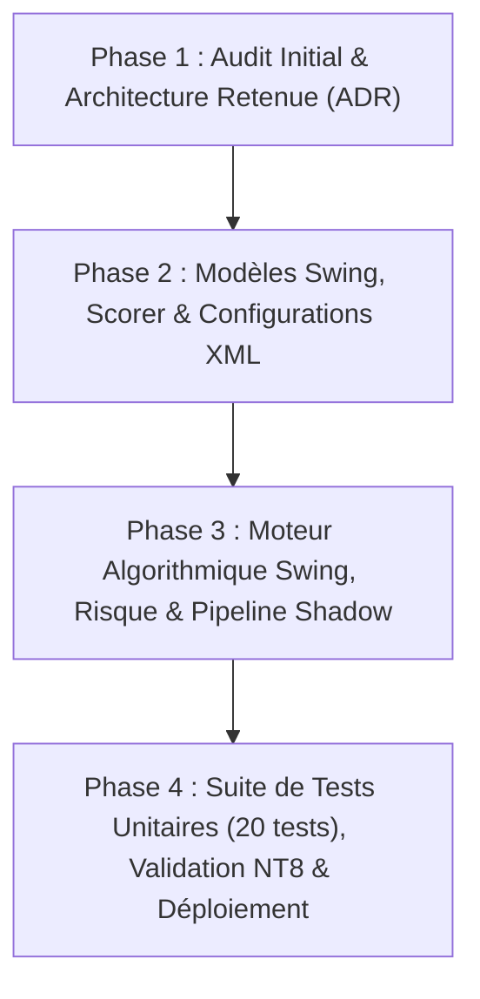

# Guide d'Exécution par Phases — Système Swing pour AuctionMarketCore (AMC-V8)

Ce document découpe le prompt d'implémentation maître (`PROMPT_IMPLEMENTATION_SWING_AUCTION_MARKET_CORE.md`) en **4 phases séquentielles et autonomes**. 

Chaque phase est conçue pour être fournie directement à l'IA ou à l'équipe de développement, garantissant une exécution **Zero-Trust**, sans perte de contexte, sans code tronqué et avec validation obligatoire avant de passer à l'étape suivante.

---

## Vue d'Ensemble des 4 Phases



| Phase | Intitulé | Objectif Principal | Livrable Clé |
| :--- | :--- | :--- | :--- |
| **Phase 1** | **Audit Initial & Architecture (ADR)** | Diagnostic factuel du dépôt, cartographie des flux et décision d'architecture sans modifier le code. | `SWING_AUDIT_AND_ADR_REPORT.md` |
| **Phase 2** | **Modèles & Configurations XML** | Création des types/modèles C# et des 8 fichiers de configuration XML Swing par instrument. | `AuctionMarketCore.Swing.Models.cs` + `configs/SWING/*.xml` |
| **Phase 3** | **Moteur Swing, Risque & Shadow** | Implémentation du moteur de calcul, scoring, gestion du risque et journal Shadow. | `AuctionMarketCore.Swing.cs` |
| **Phase 4** | **Tests Unitaires, Replay & Déploiement** | 20 tests unitaires C# Zero-Trust, protocole Market Replay NT8 et verdict final. | `Tests/Program.cs` + Rapport de validation |

---

# 🚀 PROMPT — PHASE 1 : Audit Initial & Architecture Retenue (ADR)

Copiez-collez le bloc ci-dessous pour lancer la **Phase 1** :

```markdown
# MISSION : PHASE 1 — Audit Initial, Diagnostic des Dépendances & Architecture Decision Record (ADR)

Tu es un architecte logiciel senior spécialisé en C#, NinjaTrader 8 et Auction Market Theory. Tu travailles sur le dépôt `amc-pro/AMC-V8` (moteur `AuctionMarketCore`).

## 1. Objectif de la Phase 1
Réaliser un diagnostic factuel et exhaustif du dépôt existant AVANT toute écriture de code pour le système Swing. Tu dois cartographier précisément les points d'ancrage, les flux de données, les classes partielles et figer l'Architecture Decision Record (ADR) garantissant l'isolation totale du système existant `ScalpingPro`.

## 2. Périmètre d'Audit Obligatoire (Zero-Trust)
Inspecte le code du dépôt et réponds avec preuves factuelles (Nom du fichier, Symbole, Numéro de ligne exact) sur les points suivants :

1. **Cycle de vie NinjaTrader 8** :
   - Inspecte `AuctionMarketCore.cs` : comment sont gérés `State.SetDefaults`, `State.Configure`, `State.DataLoaded`, `State.Historical`, `State.Realtime` et `State.Terminated` ?
   - Comment `OnBarUpdate()` et `OnMarketData()` sont-ils organisés ?
2. **Séries temporelles & Multi-Timeframe** :
   - Quelles sont les séries actuellement chargées via `AddDataSeries()` ?
   - Comment est géré `BarsInProgress` ? Existe-t-il déjà un support pour 1H, 4H, Daily ou Weekly ?
3. **Moteurs Existants & Dépendances** :
   - Comment fonctionnent `AuctionMarketCore.VolumeProfile.cs` (SQLite, profils clôturés, POC/VAH/VAL) et `AuctionMarketCore.Engine.cs` (VWAP, SD, Delta, CVD) ?
   - Quelles sont les liaisons entre `AuctionMarketCore.cs`, `AuctionMarketCore.ScalpingPro.cs` et `AuctionMarketCore.Sniper.cs` ?
4. **Propriétés & Sérialisation XML** :
   - Quelles sont les propriétés publiques sérialisées ? Quels attributs NinjaTrader (`[NinjaScriptProperty]`, `[XmlIgnore]`, `[Browsable]`) sont utilisés ?
5. **Gestion des Positions & Journal Shadow** :
   - Comment fonctionne actuellement le journal Shadow et l'anti-stacking dans `AuctionMarketCore.Sniper.cs` et `AuctionMarketCore.ScalpingPro.cs` ?
   - Confirmer si `AuctionMarketCore` agit en tant qu'Indicateur émetteur de signaux / journal Shadow ou en tant que Strategy NT8.
6. **Configurations existantes** :
   - Vérifier l'état de `configs/SCALPING_PRO/` (8 instruments : `MNQ`, `NQ`, `ES`, `MES`, `GC`, `MGC`, `CL`, `MCL`).

## 3. Conception de l'Architecture Retenue (ADR)
Sur la base de l'audit, compare et justifie formellement l'architecture Swing :
- Comparer l'approche classe partielle dédiée (`AuctionMarketCore.Swing.cs` + `AuctionMarketCore.Swing.Models.cs`) vs un sous-module instancié.
- Définir le mécanisme d'isolation stricte pour garantir que `ScalpingPro` n'ait **aucune modification de comportement** lorsque son preset ou ses XML sont chargés.
- Définir l'énumération de preset / mode d'activation (`Swing` / `SwingPro`).

## 4. Livrables de la Phase 1
Produis un rapport complet au format Markdown comprenant :
1. Diagnostic factuel avec références de lignes précises.
2. Tableau d'analyse des risques et dépendances.
3. Architecture Decision Record (ADR) formel pour le module Swing.
4. Plan de validation pour la Phase 2 (Modèles & XML).

⚠️ **RÈGLE STRICTE** : Ne modifie aucun fichier de code C# de production pendant cette phase.
```

---

# 🚀 PROMPT — PHASE 2 : Modèles de Données Swing, Scorer & Configurations XML

Copiez-collez le bloc ci-dessous pour lancer la **Phase 2** (après validation de la Phase 1) :

```markdown
# MISSION : PHASE 2 — Modèles de Données Swing, Interfaces de Scoring & Configurations XML

Tu es un architecte C# / NinjaTrader 8 expert. Tu poursuis le développement du module Swing pour `AuctionMarketCore` sur la base de l'ADR validé en Phase 1.

## 1. Objectif de la Phase 2
Implémenter la couche de données, les types, énumérations, interfaces de scoring Swing et générer l'ensemble des configurations XML institutionnelles pour les 8 instruments sous `configs/SWING/`.

## 2. Modèles de Données (`AuctionMarketCore.Swing.Models.cs`)
Crée le fichier `AuctionMarketCore.Swing.Models.cs` dans le namespace `NinjaTrader.NinjaScript.Indicators` avec :
1. **Énumérations dédiées** :
   - `SwingSetupType` (`REJECT_EXTREME`, `VALUE_REENTRY`, `BREAKOUT_RETEST`, `MACRO_REVERSAL`, `HTF_CONTINUATION`).
   - `SwingMarketRegime` (`TrendUp`, `TrendDown`, `Balance`, `Expansion`, `Compression`, `Transition`).
   - `SwingSignalStatus` (`Candidate`, `Validated`, `Blocked`, `Expired`, `Entered`, `Exited`).
   - `SwingTier` (`Aucun`, `Moyen`, `Fort`, `TresFort`).
2. **Structures / Classes de Contexte & Signal** :
   - `SwingContext` : encapsule les données de marché clôturées, séries HTF (1H/4H/Daily/Weekly), niveaux VP (POC, VAH, VAL), VWAP & bandes SD (±1, ±2, ±3), FVG, delta/CVD, régime et état news.
   - `SwingSignal` : horodatage, instrument, direction, type de setup, score pondéré détaillé, prix d'entrée théorique, stop structurel, stop ATR, TP1, TP2, ratio R/R, invalidations et statut.
   - `SwingWeightedScore` : décomposition transparente du score (Contexte HTF, Localisation AMT, Confirmation VP, Structure SMC, Order Flow, Risque Macro/News).
3. **Interface de Scoring** :
   - `ISwingScorer` avec méthodes `Validate(SwingContext ctx)`, `ComputeScore(SwingContext ctx)` et `ResolveTier(double score)`.

## 3. Génération des Configurations XML (`configs/SWING/`)
Crée le répertoire `configs/SWING/` et génère les 8 fichiers XML spécifiques :
- `SWING_MNQ.xml` et `SWING_NQ.xml`
- `SWING_MES.xml` et `SWING_ES.xml`
- `SWING_MGC.xml` et `SWING_GC.xml`
- `SWING_MCL.xml` et `SWING_CL.xml`

Chaque fichier XML doit contenir obligatoirement :
- `TimeframeBase` et paramètres HTF (4H / Daily).
- Niveaux VP/VWAP/SD et tolérances en ticks spécifiques à l'instrument.
- Paramètres de risque monétaire : `RiskPerTradeCurrency`, `RiskAtrPeriod`, `StopAtrMultiple`.
- Limites strictes en ticks : `MinStopTicks` et `MaxStopTicks` (adaptés à la volatilité swing de chaque instrument : ex. ES vs NQ vs CL).
- Seuils de score par famille de setup (`ThresholdMoyen`, `ThresholdFort`, `ThresholdTresFort`).
- Paramètres de gestion overnight, gaps et filtres news.

## 4. Livrables de la Phase 2
1. Fichier `AuctionMarketCore.Swing.Models.cs` complet et prêt pour la compilation C#.
2. Les 8 fichiers XML sous `configs/SWING/`.
3. Document `configs/SWING/SWING_CONFIGURATION_MATRIX.md` résumant la matrice des paramètres par instrument (TickSize, TickValue, MinStop, MaxStop, Risk/Trade).
4. Preuve de non-régression : confirmation que les XML `configs/SCALPING_PRO/` sont 100% inchangés.
```

---

# 🚀 PROMPT — PHASE 3 : Moteur Algorithmique Swing, Risque & Pipeline Shadow

Copiez-collez le bloc ci-dessous pour lancer la **Phase 3** (après validation de la Phase 2) :

```markdown
# MISSION : PHASE 3 — Implémentation du Moteur Swing, Moteur de Risque & Pipeline Shadow

Tu es un développeur expert C# NinjaTrader 8 et quant. Tu poursuis le développement du module Swing pour `AuctionMarketCore`.

## 1. Objectif de la Phase 3
Implémenter la logique algorithmique complète du système Swing dans `AuctionMarketCore.Swing.cs` et brancher proprement les points d'ancrage dans `AuctionMarketCore.cs` dans le respect absolu de l'isolation de `ScalpingPro`.

## 2. Spécifications Algorithmiques (`AuctionMarketCore.Swing.cs`)
1. **Règle Anti-Lookahead Absolue** :
   - Tous les calculs s'exécutent **exclusivement sur barres clôturées** (`BarsInProgress == 0` et après validation des clôtures HTF).
   - Aucune lecture de données intrabar ou de barres non confirmées.
2. **Détection des Niveaux & Contextes Auction Market** :
   - Lecture des profils Volume Profile clôturés (Daily, Weekly, Monthly) via l'infrastructure SQLite existante.
   - Niveaux clés : POC clôturé, VAH, VAL, HVN/LVN, VWAP clôturé et bandes SD ±1, ±2, ±3.
   - Détection structurelle multi-timeframe : Break of Structure (BOS), Change of Character (CHoCH), Fair Value Gaps (FVG) et zones de liquidité.
   - Confirmation Order Flow : delta de barre clôturée, cumul CVD et divergence volume/delta.
3. **Moteur de Setups & Scoring** :
   - Implémentation de `SwingScorer` calculant le score déterministe sur les 5 familles : `REJECT_EXTREME`, `VALUE_REENTRY`, `BREAKOUT_RETEST`, `MACRO_REVERSAL`, `HTF_CONTINUATION`.
4. **Moteur de Risque Swing & Dimensionnement** :
   - Calcul de taille de position dynamique en fonction du risque en devise (`RiskPerTradeCurrency`), de la valeur du tick réelle (`Instrument.MasterInstrument.PointValue * TickSize`), de la distance au stop et d'un buffer de slippage.
   - Stop Loss hybride : Stop structurel (au-delà du swing high/low ou de la Value Area) combiné au Stop ATR (`StopAtrMultiple * ATR`), borné impérativement entre `MinStopTicks` et `MaxStopTicks`.
   - Take Profits multi-objectifs : TP1 (niveaux intermédiaires / VWAP / POC), TP2 (extrême opposé de Value Area ou extension SD).
   - Règles de passage à Break-Even et trailing stop structurel sur nouveaux profils clôturés.
5. **Gestion des Positions & Journal Shadow** :
   - Enregistrement complet des signaux et ordres virtuels dans le journal Shadow Swing (`shadow/swing_trades.csv`).
   - Anti-stacking strict par instrument et direction.
   - Idempotence garantie : un recalcul de chart ou redémarrage de NT8 ne doit pas dupliquer de position.

## 3. Points d'Intégration Minimaux dans `AuctionMarketCore.cs`
- Déclarer `AuctionMarketCore.Swing.cs` comme classe partielle (`public partial class AuctionMarketCore`).
- Ajouter les propriétés publiques de configuration Swing proprement isolées (groupées sous `GroupName = "Swing"` avec compatibilité XML).
- Initialiser le sous-système Swing dans `OnStateChange` (State.DataLoaded / State.Configure).
- Appeler le pipeline Swing dans `OnBarUpdate()` uniquement lorsque le preset ou le mode Swing est actif, sans impacter l'exécution de `ScalpingPro`.

## 4. Livrables de la Phase 3
1. Code source complet de `AuctionMarketCore.Swing.cs`.
2. Diff propre et documenté des modifications apportées à `AuctionMarketCore.cs`.
3. Preuve que le chemin d'exécution de `ScalpingPro` reste totalement inchangé.
```

---

# 🚀 PROMPT — PHASE 4 : Suite de Tests Unitaires (20 tests), Validation NT8 & Déploiement

Copiez-collez le bloc ci-dessous pour lancer la **Phase 4** (après validation de la Phase 3) :

```markdown
# MISSION : PHASE 4 — Tests Unitaires C# Zero-Trust, Protocole de Validation NT8 & Procédure de Déploiement

Tu es un ingénieur QA senior et spécialiste quantitatif C# NinjaTrader 8. Tu finalises l'implémentation du système Swing pour `AuctionMarketCore`.

## 1. Objectif de la Phase 4
Créer la suite de tests automatisés C# validant les 20 critères du cahier des charges, documenter la validation dans NinjaTrader 8 (Market Replay) et fournir les guides de déploiement et de rollback.

## 2. Suite de Tests Unitaires C# (`Tests/Program.cs`)
Ajoute ou étends le projet de test unitaire autonome en C# pour couvrir formellement les 20 points :
1. **Anti-lookahead multi-timeframe** (validation de non-lecture de la barre 0).
2. **Déterminisme des calculs VP clôturés** (POC/VAH/VAL).
3. **Calcul VWAP et bandes SD** (±1, ±2, ±3) sur barres clôturées.
4. **Détection des régimes de marché**.
5. **Setup Rejet d'Extrême & Réintégration Value Area**.
6. **Setup Breakout & Retest**.
7. **Validation Structure SMC + Order Flow**.
8. **Calcul du Stop hybride (Structurel / ATR)**.
9. **Dimensionnement de position selon la valeur du tick** (`NQ`, `ES`, `GC`, `CL`).
10. **Respect strict des bornes `MinStopTicks` et `MaxStopTicks`**.
11. **Filtre Anti-Stacking**.
12. **Idempotence après redémarrage / recalcul**.
13. **Filtre News et gestion des fuseaux horaires (UTC/EST)**.
14. **Gestion des Gaps, Rollover et sessions CME**.
15. **Règles de sorties partielles (TP1, TP2) et Trailing Stop**.
16. **Non-régression de `ScalpingPro`** (exécution comparative de tests ScalpingPro).
17. **Validation du parsing des 8 XML `configs/SWING/*.xml`**.
18. **Synchronisation du script de déploiement NT8**.
19. **Sécurité des chemins, logs et absence de secrets/hardcoding**.
20. **Absence de code mort ou d'anciens presets obsolètes**.

Exécute les tests via `dotnet run --project Tests/VolumeProfileTests.csproj` (ou runner équivalent) et fournis la sortie console complète avec 100% de succès.

## 3. Protocole de Validation NinjaTrader 8 & Market Replay
Fournis un guide détaillé pour :
- La compilation sans avertissement dans le NinjaScript Editor de NinjaTrader 8.
- La configuration d'un chart Swing NT8 (séries de données requises, temps de chargement, modèles).
- Le protocole de Market Replay sur 3 sessions représentatives (Trend Day, Balance Day, News Day).
- La vérification du journal Shadow Swing et des alertes.

## 4. Livrables de la Phase 4
1. Fichier `Tests/Program.cs` mis à jour avec les 20 tests unitaires.
2. Rapport de test Zero-Trust : `ZERO_TRUST_SWING_TEST_REPORT.md` (Entrées, Attendu, Observé, Statut PASS).
3. Guide de déploiement et procédure de rollback : `SWING_DEPLOYMENT_AND_ROLLBACK_GUIDE.md`.
4. Résumé comparatif : `SCALPING_PRO_VS_SWING_DIFFERENCES.md`.
5. Verdict final de readiness : `GO SIMULATION`, `GO CONDITIONNEL` ou `NO-GO`.
```

---

## Guide d'Utilisation

1. **Lancement séquentiel** : Lancez la **Phase 1** en premier. Attendez la fin de l'audit et validez l'ADR avant de lancer la suite.
2. **Validation intermédiaire** : Chaque phase produit des livrables vérifiables. Vérifiez les fichiers créés avant de lancer la phase suivante.
3. **Qualité maximale** : Cette approche garantit qu'aucune section de code ne sera abrégée ou tronquée par les limites de contexte de l'IA.
