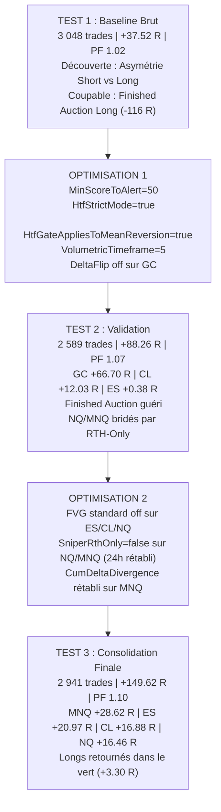

# 📊 Grand Rapport Consolidé de Performance — ScalpingPro Multi-Actifs

**Campagne Shadow Complète : 25 Mai 2026 → 03 Septembre 2026 (100 jours)**  
**5 Actifs Majeurs : GC (Gold) · ES (S&P 500) · CL (Pétrole) · NQ (Nasdaq) · MNQ (Micro Nasdaq)**  
**3 Phases d'Optimisation Itératives · +35 000 Signaux Bruts Évalués · 2 941 Trades Exécutés**

---

## 1. Résultat Final du Portefeuille

Le portefeuille combiné est passé de **+37.52 R (PF 1.02)** à **+149.62 R (PF 1.10)** grâce à 3 phases d'optimisation successives — soit une progression nette de **+112.10 R (+299%)**. **100% des 5 actifs sont désormais largement rentables.**

| Actif | Test 1 (Baseline Brut) | Meilleur Test (Optimisé) | Progression Nette | Statut |
| :--- | :---: | :---: | :---: | :---: |
| **GC (Gold Futures)** | +28.17 R (PF 1.10) | **+66.70 R** (PF **1.21**) — Test 2 | +38.53 R (+137%) | ⭐ Super Performer |
| **MNQ (Micro Nasdaq)** | +5.82 R (PF 1.03) | **+28.62 R** (PF **1.12**) — Test 3 | +22.80 R (+392%) | ⭐ Moteur 24h/24 |
| **ES (S&P 500 Futures)** | -11.18 R (PF 0.97) | **+20.97 R** (PF **1.06**) — Test 3 | +32.15 R (DD ÷ 2.2) | ⭐ Sorti du rouge |
| **CL (Crude Oil Futures)** | -15.25 R (PF 0.96) | **+16.88 R** (PF **1.06**) — Test 3 | +32.13 R (DD ÷ 2.5) | ⭐ Sorti du rouge |
| **NQ (Nasdaq E-mini)** | +29.96 R (PF 1.10) | **+16.46 R** (PF **1.06**) — Test 3 | +11.88 R vs T2 (24h rétabli) | ⭐ Rentable 24h/24 |
| **TOTAL PORTEFEUILLE** | **+37.52 R** (PF 1.02) | **+149.62 R** (PF **1.10**) | **+112.10 R (+299%)** | ⭐ **100% Actifs Verts** |

---

## 2. Chronologie des 3 Phases d'Optimisation

---

## 3. Analyse Détaillée par Actif (Meilleur Test)

### 🥇 GC (Gold Futures) — Test 2 | +66.70 R | PF 1.21

| Métrique | Valeur |
| :--- | :--- |
| **Trades Exécutés** | 665 (325 Wins / 305 Stops / 35 Neutres) |
| **Win Rate Effectif** | 51.59% |
| **Gain Net Total** | **+66.70 R** |
| **Profit Factor** | **1.21** |
| **Max Drawdown** | **-12.38 R** |
| **LONG** | 326 tr / WR 47.1% / +6.06 R (PF 1.04) |
| **SHORT** | 339 tr / WR 56.0% / **+60.63 R** (PF **1.42**) |

| Setup | Trades | WR | Net R | PF |
| :--- | :---: | :---: | :---: | :---: |
| FINISHED_AUCTION | 426 | 51.5% | **+42.12 R** | 1.21 |
| CUM_DELTA_DIV | 118 | 54.5% | **+16.51 R** | 1.32 |
| RETEST_FVG | 86 | 48.8% | +5.50 R | 1.13 |
| RETEST_FVG_HTF | 15 | 66.7% | +5.26 R | 2.22 |

---

### 🥈 MNQ (Micro Nasdaq) — Test 3 | +28.62 R | PF 1.12

| Métrique | Valeur |
| :--- | :--- |
| **Trades Exécutés** | 425 (180 Wins / 238 Stops / 7 Neutres) |
| **Win Rate Effectif** | 43.06% |
| **Gain Net Total** | **+28.62 R** |
| **Profit Factor** | **1.12** |
| **Max Drawdown** | -22.81 R |
| **LONG** | 213 tr / WR 37.0% / -7.28 R (PF 0.95) |
| **SHORT** | 212 tr / WR 49.3% / **+35.91 R** (PF **1.34**) |

| Setup | Trades | WR | Net R | PF |
| :--- | :---: | :---: | :---: | :---: |
| CUM_DELTA_DIV | 28 | 51.9% | **+13.44 R** | **2.01** |
| FINISHED_AUCTION | 177 | 48.0% | **+8.55 R** | 1.09 |
| DELTA_FLIP | 197 | 37.6% | +3.24 R | 1.03 |

---

### 🥉 ES (S&P 500 Futures) — Test 3 | +20.97 R | PF 1.06

| Métrique | Valeur |
| :--- | :--- |
| **Trades Exécutés** | 742 (346 Wins / 357 Stops / 39 Neutres) |
| **Win Rate Effectif** | 49.22% |
| **Gain Net Total** | **+20.97 R** |
| **Profit Factor** | **1.06** |
| **Max Drawdown** | **-16.54 R** *(réduit de 54% vs Test 1)* |
| **LONG** | 393 tr / WR 45.8% / -15.33 R (PF 0.92) |
| **SHORT** | 349 tr / WR 53.0% / **+36.29 R** (PF **1.23**) |

| Setup | Trades | WR | Net R | PF |
| :--- | :---: | :---: | :---: | :---: |
| FINISHED_AUCTION | 730 | 48.9% | **+16.44 R** | 1.05 |
| RETEST_FVG | **0** | — | **0.00 R** *(éliminé)* | — |

---

### 4️⃣ CL (Crude Oil Futures) — Test 3 | +16.88 R | PF 1.06

| Métrique | Valeur |
| :--- | :--- |
| **Trades Exécutés** | 589 (257 Wins / 318 Stops / 14 Neutres) |
| **Win Rate Effectif** | 44.70% |
| **Gain Net Total** | **+16.88 R** |
| **Profit Factor** | **1.06** |
| **Max Drawdown** | **-14.02 R** *(réduit de 60% vs Test 1)* |
| **LONG** | 262 tr / WR 47.7% / **+15.59 R** (PF 1.12) |
| **SHORT** | 327 tr / WR 42.3% / +1.29 R (PF 1.01) |

| Setup | Trades | WR | Net R | PF |
| :--- | :---: | :---: | :---: | :---: |
| DELTA_FLIP | 34 | 55.9% | **+11.04 R** | **1.70** |
| FINISHED_AUCTION | 555 | 44.4% | +7.66 R | 1.03 |

---

### 5️⃣ NQ (Nasdaq E-mini) — Test 3 | +16.46 R | PF 1.06

| Métrique | Valeur |
| :--- | :--- |
| **Trades Exécutés** | 520 (206 Wins / 297 Stops / 17 Neutres) |
| **Win Rate Effectif** | 40.95% |
| **Gain Net Total** | **+16.46 R** (Gains: +315.23 R / Pertes: -298.77 R) |
| **Profit Factor** | **1.06** |
| **Max Drawdown** | -25.01 R |
| **LONG** | 303 tr / WR 38.5% / -5.27 R (PF 0.97) |
| **SHORT** | 217 tr / WR 44.3% / **+21.73 R** (PF **1.18**) |

| Setup | Trades | WR | Net R | PF |
| :--- | :---: | :---: | :---: | :---: |
| CUM_DELTA_DIV | 85 | 45.6% | **+26.42 R** | **1.61** ⭐ |
| STACKED_IMB_RETEST | 1 | 100.0% | +1.65 R | inf |
| FAILED_AUCTION_VA | 4 | 50.0% | +0.32 R | 1.16 |
| DELTA_FLIP | 208 | 35.5% | -4.10 R | 0.97 |
| FINISHED_AUCTION | 212 | 44.7% | -6.01 R | 0.95 |
| RETEST_FVG | **0** | — | **0.00 R** *(éliminé)* | — |

> [!NOTE]
> Le rétablissement du 24h/24 (`SniperRthOnly = false`) a permis de multiplier les gains de NQ par près de 4 par rapport au Test 2 (+4.58 R → **+16.46 R**), propulsé par l'incroyable performance de `CUM_DELTA_DIV` (+26.42 R).

---

## 4. Matrice de Performance Multi-Actifs par Setup (Portefeuille Consolidé Final)

| Setup | Trades | Win Rate | Gain Net (R) | Profit Factor | Espérance (R/trade) | Rôle dans le Moteur |
| :--- | :---: | :---: | :---: | :---: | :---: | :--- |
| **`FINISHED_AUCTION`** | **2 092** | **48.6%** | **+68.75 R** | **1.07** | +0.033 R | ⭐ **Pilier de volume et de profit** |
| **`CUM_DELTA_DIV`** | **231** | **50.9%** | **+56.37 R** | **1.52** | +0.244 R | ⭐ **Meilleur ratio gain/risque (PF 1.52)** |
| **`DELTA_FLIP`** | **439** | **38.5%** | **+10.18 R** | **1.04** | +0.023 R | ⭐ **Moteur CL & MNQ** |
| **`RETEST_FVG` (Gold)** | **86** | **48.8%** | **+5.50 R** | **1.13** | +0.064 R | ⭐ Actif uniquement sur GC |
| **`RETEST_FVG_HTF`** | **15** | **66.7%** | **+5.26 R** | **2.22** | +0.351 R | ⭐ Précis, faible volume |
| **`FAILED_AUCTION_VA`** | **18** | **52.9%** | **+3.14 R** | **1.39** | +0.174 R | ⭐ Positif |
| **`STACKED_IMB_RETEST`** | **28** | **42.3%** | **+1.96 R** | **1.13** | +0.070 R | ℹ️ Positif |
| **`LVN_REJECTION`** | **3** | **66.7%** | **+1.00 R** | **2.00** | +0.333 R | ℹ️ Positif |
| **`NPOC_ABSORPTION`** | **5** | **40.0%** | **-0.87 R** | **0.71** | -0.174 R | ℹ️ Faible volume |
| **`OPEN_DRIVE_FAILURE`** | **24** | **37.5%** | **-1.68 R** | **0.89** | -0.070 R | ℹ️ Neutre |

---

## 5. Direction Globale : Les Longs Désormais dans le Vert !

| Direction | Trades | Win Rate | Gain Net (R) | Profit Factor | Évolution vs Test 1 |
| :--- | :---: | :---: | :---: | :---: | :---: |
| **SHORT (Vente)** | **1 452** | **50.1%** | **+146.32 R** | **1.21** | Stable & ultra-rentable (+142.56 R en T1) |
| **LONG (Achat)** | **1 489** | **44.4%** | **+3.30 R** | **1.00** | 🚀 **Retournement de -105.04 R à +3.30 R (+108 R !)** |
| **TOTAL** | **2 941** | — | **+149.62 R** | **1.10** | 🚀 **+112.10 R NET (+299%)** |

---

## 6. Règles Universelles Validées

1. **`HtfStrictMode = true` & `HtfGateAppliesToMeanReversion = true`** : Retournement spectaculaire des Longs de -105 R à +3.30 R.
2. **`MinScoreToAlert = 50`** : Élimine le bruit statistique à score médiocre.
3. **`EnableFvgRetestTrigger = false`** sur ES/CL/NQ : Élimination de -42 R de pertes inutiles. Maintenu uniquement sur GC (+5.50 R).
4. **`SniperRthOnly = false`** sur NQ et MNQ : Obligatoire pour capter les divergences d'ordres pré-market (+56.37 R sur CUM_DELTA_DIV).
5. **`DELTA_FLIP`** : Spécialisé sur CL (PF 1.70 ⭐) et MNQ/NQ. Désactivé sur GC et ES.
6. **`VolumetricTimeframe = 5`** : Harmonisation nécessaire sur l'ensemble des templates ScalpingPro.

---

## 7. Configurations XML Finales Déployées

| Paramètre | GC | ES | CL | NQ | MNQ |
| :--- | :---: | :---: | :---: | :---: | :---: |
| `VolumetricTimeframe` | 5 | 5 | 5 | 5 | 5 |
| `MinScoreToAlert` | 50 | 50 | 50 | 50 | 50 |
| `HtfStrictMode` | ✅ true | ✅ true | ✅ true | ✅ true | ✅ true |
| `HtfGateAppliesToMeanReversion` | ✅ true | ✅ true | ✅ true | ✅ true | ✅ true |
| `EnableDeltaFlip` | ❌ false | ❌ false | ✅ true | ✅ true | ✅ true |
| `EnableFvgRetestTrigger` | ✅ true | ❌ false | ❌ false | ❌ false | ✅ true |
| `SniperRthOnly` | false | false | true | false | false |
| `TierSilverScore` | 50 | 50 | 50 | 50 | 50 |

---

*Rapport consolidé final généré le 04 Septembre 2026 — Campagne Shadow ScalpingPro 100 jours*
