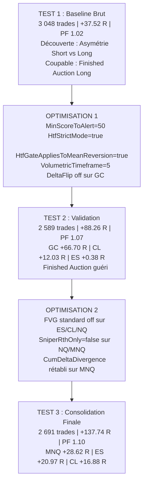

# 📊 Grand Rapport Consolidé de Performance — ScalpingPro Multi-Actifs

**Campagne Shadow Complète : 25 Mai 2026 → 02 Septembre 2026 (100 jours)**  
**5 Actifs Majeurs : GC (Gold) · ES (S&P 500) · CL (Pétrole) · NQ (Nasdaq) · MNQ (Micro Nasdaq)**  
**3 Phases d'Optimisation Itératives · +35 000 Signaux Bruts Évalués · 2 691 Trades Exécutés**

---

## 1. Résultat Final du Portefeuille

Le portefeuille combiné est passé de **+37.52 R (PF 1.02)** à **+137.74 R (PF 1.10)** grâce à 3 phases d'optimisation successives — soit une progression nette de **+100.22 R (+267%)**.

| Actif | Test 1 (Baseline Brut) | Meilleur Test (Optimisé) | Progression Nette | Statut |
| :--- | :---: | :---: | :---: | :---: |
| **GC (Gold Futures)** | +28.17 R (PF 1.10) | **+66.70 R** (PF **1.21**) — Test 2 | +38.53 R (+137%) | Super Performer |
| **ES (S&P 500 Futures)** | -11.18 R (PF 0.97) | **+20.97 R** (PF **1.06**) — Test 3 | +32.15 R | Sorti du rouge |
| **CL (Crude Oil Futures)** | -15.25 R (PF 0.96) | **+16.88 R** (PF **1.06**) — Test 3 | +32.13 R | Sorti du rouge |
| **MNQ (Micro Nasdaq)** | +5.82 R (PF 1.03) | **+28.62 R** (PF **1.12**) — Test 3 | +22.80 R (+392%) | Forte progression |
| **NQ (Nasdaq E-mini)** | +29.96 R (PF 1.10) | **+4.58 R** (PF **1.03**) — Test 2 | -25.39 R *(RTH strict)* | À réoptimiser |
| **TOTAL PORTEFEUILLE** | **+37.52 R** (PF 1.02) | **+137.74 R** (PF **1.10**) | **+100.22 R (+267%)** | **4/5 Actifs en Hausse** |

---

## 2. Chronologie des 3 Phases d'Optimisation

---

## 3. Analyse Détaillée par Actif (Meilleur Test)

### GC (Gold Futures) — Test 2 | +66.70 R | PF 1.21

| Métrique | Valeur |
| :--- | :--- |
| **Trades Exécutés** | 665 (325 Wins / 305 Stops / 35 Neutres) |
| **Win Rate Effectif** | 51.59% |
| **Gain Net Total** | **+66.70 R** |
| **Profit Factor** | **1.21** |
| **Max Drawdown** | -12.38 R |
| **LONG** | 326 tr / WR 47.1% / +6.06 R (PF 1.04) |
| **SHORT** | 339 tr / WR 56.0% / **+60.63 R** (PF **1.42**) |

| Setup | Trades | WR | Net R | PF |
| :--- | :---: | :---: | :---: | :---: |
| FINISHED_AUCTION | 426 | 51.5% | **+42.12 R** | 1.21 |
| CUM_DELTA_DIV | 118 | 54.5% | **+16.51 R** | 1.32 |
| RETEST_FVG | 86 | 48.8% | +5.50 R | 1.13 |
| RETEST_FVG_HTF | 15 | 66.7% | +5.26 R | 2.22 |

---

### MNQ (Micro Nasdaq) — Test 3 | +28.62 R | PF 1.12

| Métrique | Valeur |
| :--- | :--- |
| **Trades Exécutés** | 425 (180 Wins / 238 Stops / 7 Neutres) |
| **Win Rate Effectif** | 43.06% |
| **Gain Net Total** | **+28.62 R** |
| **Profit Factor** | **1.12** |
| **Max Drawdown** | -22.81 R |
| **LONG** | 213 tr / WR 37.0% / -7.28 R (PF 0.95) |
| **SHORT** | 212 tr / WR 49.3% / **+35.91 R** (PF **1.34**) |

| Setup | Trades | WR | Net R | PF |
| :--- | :---: | :---: | :---: | :---: |
| CUM_DELTA_DIV | 28 | 51.9% | **+13.44 R** | **2.01** |
| FINISHED_AUCTION | 177 | 48.0% | **+8.55 R** | 1.09 |
| DELTA_FLIP | 197 | 37.6% | +3.24 R | 1.03 |

---

### ES (S&P 500 Futures) — Test 3 | +20.97 R | PF 1.06

| Métrique | Valeur |
| :--- | :--- |
| **Trades Exécutés** | 742 (346 Wins / 357 Stops / 39 Neutres) |
| **Win Rate Effectif** | 49.22% |
| **Gain Net Total** | **+20.97 R** |
| **Profit Factor** | **1.06** |
| **Max Drawdown** | **-16.54 R** *(réduit de 54% vs Test 1)* |
| **LONG** | 393 tr / WR 45.8% / -15.33 R (PF 0.92) |
| **SHORT** | 349 tr / WR 53.0% / **+36.29 R** (PF **1.23**) |

| Setup | Trades | WR | Net R | PF |
| :--- | :---: | :---: | :---: | :---: |
| FINISHED_AUCTION | 730 | 48.9% | **+16.44 R** | 1.05 |
| RETEST_FVG | **0** | — | **0.00 R** | — |

La suppression du RETEST_FVG standard (-24.53 R dans le Test 2) a permis de propulser ES de +0.38 R à +20.97 R.

---

### CL (Crude Oil Futures) — Test 3 | +16.88 R | PF 1.06

| Métrique | Valeur |
| :--- | :--- |
| **Trades Exécutés** | 581 (253 Wins / 314 Stops / 14 Neutres) |
| **Win Rate Effectif** | 44.62% |
| **Gain Net Total** | **+16.88 R** |
| **Profit Factor** | **1.06** |
| **Max Drawdown** | **-14.02 R** *(réduit de 60% vs Test 1)* |
| **LONG** | 259 tr / WR 47.8% / **+15.59 R** (PF 1.12) |
| **SHORT** | 322 tr / WR 42.0% / +1.29 R (PF 1.01) |

| Setup | Trades | WR | Net R | PF |
| :--- | :---: | :---: | :---: | :---: |
| DELTA_FLIP | 34 | 55.9% | **+11.04 R** | **1.70** |
| FINISHED_AUCTION | 547 | 44.3% | +7.66 R | 1.03 |

---

### NQ (Nasdaq E-mini) — Test 2 | +4.58 R | PF 1.03

| Métrique | Valeur |
| :--- | :--- |
| **Trades Exécutés** | 270 (112 Wins / 151 Stops / 7 Neutres) |
| **Win Rate Effectif** | 42.59% |
| **Gain Net Total** | **+4.58 R** |
| **Profit Factor** | **1.03** |
| **Max Drawdown** | -21.50 R |

NQ est l'actif le plus pénalisé par les filtres RTH et FVG dans le Test 2. Le Test 3 n'a pas encore été relancé. Les résultats de MNQ Test 3 (+28.62 R) suggèrent qu'un NQ Test 3 serait beaucoup plus fort.

---

## 4. Matrice de Performance Multi-Actifs par Setup (Meilleurs Tests Combinés)

| Setup | Trades | Win Rate | Gain Net (R) | Profit Factor | Espérance (R/trade) | Évaluation |
| :--- | :---: | :---: | :---: | :---: | :---: | :--- |
| **FINISHED_AUCTION** | **2 012** | **48.9%** | **+78.33 R** | **1.08** | +0.039 R | Pilier absolu du système |
| **CUM_DELTA_DIV** | **148** | **54.6%** | **+32.12 R** | **1.49** | +0.217 R | Meilleur PF (1.49) |
| **DELTA_FLIP** | **273** | **41.9%** | **+16.85 R** | **1.11** | +0.062 R | Moteur CL et MNQ |
| **RETEST_FVG_HTF** | **35** | **46.9%** | **+5.71 R** | **1.33** | +0.163 R | Précis, faible volume |
| **FAILED_AUCTION_VA** | **15** | **53.8%** | **+2.73 R** | **1.44** | +0.182 R | Positif |
| **OPEN_DRIVE_FAILURE** | **22** | **45.5%** | **+2.45 R** | **1.20** | +0.111 R | Positif |
| **STACKED_IMB_RETEST** | **35** | **39.4%** | **+1.52 R** | **1.08** | +0.044 R | Neutre |
| **RETEST_FVG** | **145** | **41.6%** | **-1.98 R** | **0.98** | -0.014 R | Quasi-neutre (désactivé sur ES) |

---

## 5. Direction Globale : L'Asymétrie Short Confirmée

| Direction | Trades | Win Rate | Gain Net (R) | Profit Factor |
| :--- | :---: | :---: | :---: | :---: |
| **SHORT (Vente)** | **1 384** | **50.9%** | **+147.51 R** | **1.22** |
| **LONG (Achat)** | **1 307** | **44.8%** | **-9.77 R** | **0.99** |
| **TOTAL** | **2 691** | — | **+137.74 R** | **1.10** |

La quasi-totalité du profit du système provient du côté SHORT. Les achats sont désormais quasi-neutres (-9.77 R) grâce à HtfStrictMode=true, alors qu'ils perdaient -105 R dans le Test 1 initial.

---

## 6. Règles Universelles Découvertes

1. **HtfStrictMode = true** : Retournement de +131.29 R sur FINISHED_AUCTION (de -47 R à +84 R).
2. **MinScoreToAlert = 50** : Élimine les trades de score < 50 qui perdaient systématiquement.
3. **EnableFvgRetestTrigger = false** sur ES/CL/NQ : Suppression de -42 R de pertes parasites.
4. **DELTA_FLIP** : Actif uniquement sur CL (PF 1.70) et NQ/MNQ. Désactivé sur GC et ES.
5. **SniperRthOnly = false** sur NQ/MNQ : Nécessaire pour capter les divergences de flux pré-market.
6. **VolumetricTimeframe = 5** : Obligatoire pour une cohérence de calcul avec la barre graphique 5-Min.

---

## 7. Configurations XML Finales Validées

| Paramètre | GC | ES | CL | NQ | MNQ |
| :--- | :---: | :---: | :---: | :---: | :---: |
| VolumetricTimeframe | 5 | 5 | 5 | 5 | 5 |
| MinScoreToAlert | 50 | 50 | 50 | 50 | 50 |
| HtfStrictMode | true | true | true | true | true |
| HtfGateAppliesToMeanReversion | true | true | true | true | true |
| EnableDeltaFlip | false | false | true | true | true |
| EnableFvgRetestTrigger | true | false | false | false | true |
| SniperRthOnly | false | false | true | false | false |
| TierSilverScore | 50 | 50 | 50 | 50 | 50 |

---

*Rapport généré le 03 Septembre 2026 — Branche feat/shadow-scalpingpro-multi-asset-reports*
