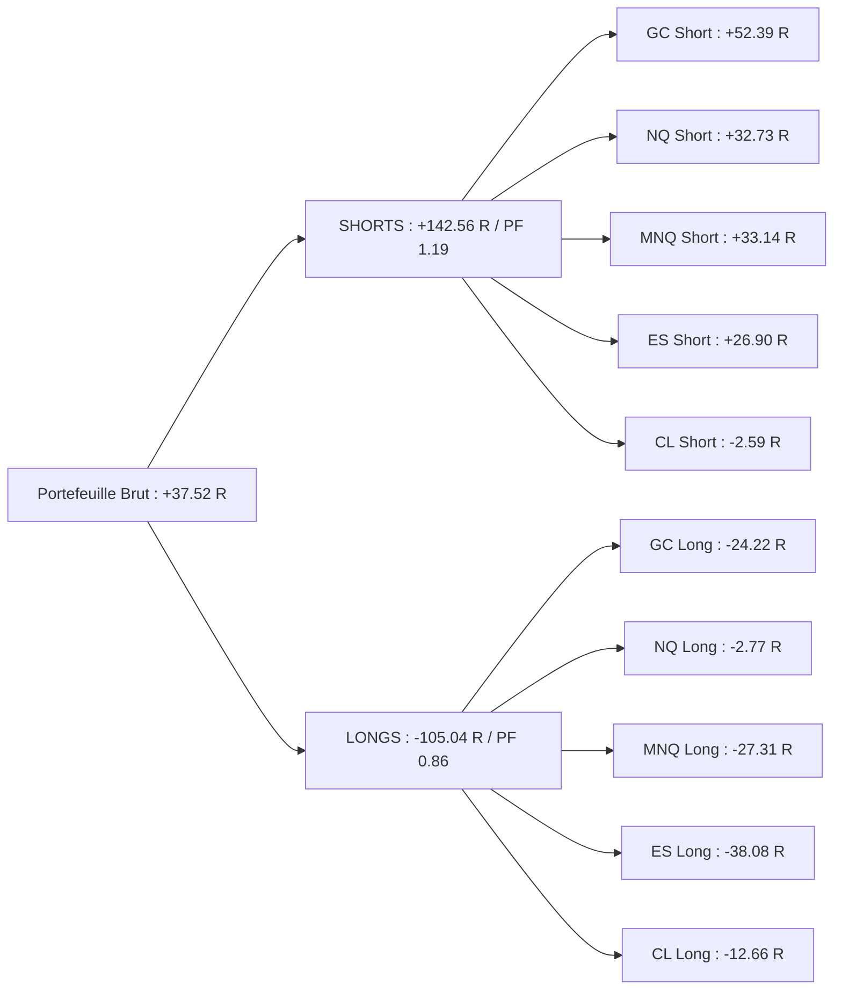

# Rapport Consolidé Multi-Actifs Shadow — Mode Scalping Pro (Sniper)
**Actifs Analysés :** GC (Gold), MNQ (Micro Nasdaq), ES (S&P 500), CL (Pétrole Brut), NQ (Nasdaq E-mini)  
**Période commune :** 25 Mai 2026 au 01 Septembre 2026 (11 630 barres 5-min par actif)  
**Total des signaux évalués :** 35 300 signaux détectés \| 23 155 filtrés par le Sniper (65.6%)  
**Total des trades exécutés :** **3 048 trades**  
**Date du rapport :** 01 Septembre 2026  

---

## 1. Tableau Comparatif des 5 Actifs (Baseline Brut)

| Actif | Trades | Wins | Losses | Neutres | Win Rate Eff. | Gain Net (R) | Profit Factor | Espérance (R) | Max DD (R) |
| :--- | :---: | :---: | :---: | :---: | :---: | :---: | :---: | :---: | :---: |
| **GC (Gold)** | 581 | 272 | 281 | 28 | **49.19 %** | **+28.17 R** | **1.10** | +0.048 R | -15.80 R |
| **NQ (Nasdaq E-mini)** | 512 | 203 | 286 | 23 | **41.51 %** | **+29.96 R** | **1.09** | +0.059 R | -19.49 R |
| **MNQ (Micro NQ)** | 379 | 146 | 222 | 11 | **39.67 %** | **+5.82 R** | **0.99** | +0.015 R | -25.42 R |
| **ES (S&P 500)** | 801 | 358 | 399 | 44 | **47.29 %** | **-11.18 R** | **0.96** | -0.014 R | -35.86 R |
| **CL (Crude Oil)** | 775 | 346 | 390 | 39 | **47.01 %** | **-15.25 R** | **0.96** | -0.020 R | -34.64 R |
| **TOTAL PORTEFEUILLE** | **3 048** | **1 325** | **1 578** | **145** | **45.64 %** | **+37.52 R** | **1.01** | **+0.012 R** | **-56.41 R** |

```mermaid
pie title Contribution au PnL Net Total Brut (37.52 R)
    "NQ (Nasdaq)" : 29.96
    "GC (Gold)" : 28.17
    "MNQ (Micro NQ)" : 5.82
    "ES (S&P 500)" : -11.18
    "CL (Crude Oil)" : -15.25
```

---

## 2. La Règle d'Or Universelle : L'Asymétrie SHORT vs LONG

Sur les 3 048 trades cumulés, la totalité de la performance du portefeuille provient des positions **SHORT (Vente)** :

| Direction | Trades | Win Rate Effectif | Gain Net (R) | Profit Factor | Espérance (R) |
| :--- | :---: | :---: | :---: | :---: | :---: |
| **SHORT (Vente)** | **1 541** | **50.00 %** | **+142.56 R** | **1.19** | **+0.093 R** ⭐ |
| **LONG (Achat)** | **1 507** | **41.17 %** | **-105.04 R** | **0.86** | **-0.070 R** ❌ |
| **ÉCART DIRECTIONNEL** | - | **+8.83 %** | **+247.60 R** | - | - |



### Le diagnostic du déficit Long :
1. **`FINISHED_AUCTION` Long génère -116.54 R de pertes à lui seul** sur les 5 actifs.
2. Shorter les sommets d'épuisement (`FINISHED_AUCTION` Short) est rentable sur **100% des actifs** (+69.36 R au total).
3. Acheter les bas d'épuisement sans alignement HTF strict dans un marché d'été baissier a coûté plus de **116 R**.

---

## 3. Matrice Croisée Setups x Actifs (Net R)

| Setup | CL | ES | GC | MNQ | NQ | **TOTAL (R)** | Statut & Spécialisation |
| :--- | :---: | :---: | :---: | :---: | :---: | :---: | :--- |
| **`DELTA_FLIP`** | **+16.78** | -4.00 | -6.88 | **+7.95** | **+20.64** | **+34.49 R** | ⭐ **Setup Roi sur NQ, CL & MNQ** |
| **`CUM_DELTA_DIV`** | -12.96 | -4.91 | **+24.73** | **+3.00** | **+14.82** | **+24.68 R** | ⭐ **Setup Roi sur GC & NQ** |
| **`OPEN_DRIVE_FAILURE`** | 0.00 | **+1.34** | **+2.87** | **+6.92** | **+3.61** | **+14.74 R** | ⭐ **Universellement Positif (PF 1.47)** |
| **`RETEST_FVG`** | -1.63 | **+2.87** | **+8.67** | -0.25 | -1.62 | **+8.04 R** | ⭐ **Top Setup sur Gold & ES** |
| **`RETEST_FVG_HTF`** | **+3.04** | **+3.54** | **+3.39** | -2.82 | -4.15 | **+3.00 R** | ⭐ **Excellent sur ES, GC, CL** |
| **`NPOC_ABSORPTION`** | 0.00 | 0.00 | 0.00 | 0.00 | **+1.13** | **+1.13 R** | ℹ️ Rare mais précis |
| **`LVN_REJECTION`** | **+1.99** | 0.00 | -1.00 | 0.00 | 0.00 | **+0.99 R** | ℹ️ Rentable sur Pétrole |
| **`STACKED_IMB_RETEST`**| 0.00 | 0.00 | -0.02 | -0.01 | -0.22 | -0.25 R | ℹ️ Neutre |
| **`FAILED_AUCTION_VA`** | +0.18 | -1.00 | -1.00 | **+2.50** | -2.78 | -2.10 R | ⚠️ Inconsistant |
| **`FINISHED_AUCTION`** | -22.65 | -9.02 | -2.58 | -11.46 | -1.48 | **-47.19 R** | ❌ **Short +69.4R vs Long -116.5R** |

---

## 4. Matrice Temporelle Consolidée (Heures UTC)

```mermaid
pie title Répartition du PnL Net par Créneaux Horaires Globaux (R)
    "Open US & Midday (14h, 17h, 18h)" : 72.1
    "Open Asie & Europe (02h, 07h, 10h)" : 31.1
    "Overnight & Chop (04h, 06h, 08h, 09h, 16h, 20h)" : -85.6
```

- **Top Créneaux Universels :**
  - **14h00 UTC (Open US) :** **+36.23 R** (Positif sur les 5 actifs !) ⭐
  - **17h00 UTC (US Midday) :** **+31.04 R** (Positif sur les 5 actifs !) ⭐
  - **02h00 UTC (Session Asie) :** **+14.37 R** (Fort sur GC et NQ) ⭐
  - **07h00 UTC (Open Londres) :** **+13.22 R** (Fort sur ES et MNQ) ⭐
- **Pires Créneaux Toxiques :**
  - **09h00 UTC :** **-19.85 R**
  - **06h00 UTC :** **-17.42 R**
  - **20h00 UTC :** **-13.18 R**
  - **16h00 UTC :** **-12.80 R**
  - **08h00 UTC :** **-12.49 R**

---

## 5. Matrice des Scénarios d'Optimisation du Portefeuille

| Scénario Simulé sur le Portefeuille 5 Actifs | Trades | WR Effectif | Gain Net (R) | Profit Factor | Espérance (R) | Max DD (R) |
| :--- | :---: | :---: | :---: | :---: | :---: | :---: |
| **1. Baseline Brut (Tous actifs, tous trades)** | 3 048 | 45.6 % | +37.52 R | 1.01 | +0.012 R | -56.41 R |
| **2. SHORTS Uniquement (5 actifs)** | **1 541** | **50.0 %** | **+142.56 R** | **1.19** | **+0.093 R** | **-21.20 R** |
| **3. Exclusion de `FINISHED_AUCTION` Long** | **2 252** | **47.6 %** | **+154.07 R** | **1.13** | **+0.068 R** | **-37.92 R** |
| **4. Exclusion FA Long + Score $\ge$ 50** | **1 742** | **47.1 %** | **+116.27 R** | **1.12** | **+0.067 R** | **-37.24 R** |
| **5. Top Setups par Actif Spécifique** | **866** | **46.9 %** | **+128.66 R** | **1.27** | **+0.149 R** | **-24.97 R** |
| **6. Top Setups par Actif + Score $\ge$ 50** | **690** | **47.6 %** | **+122.22 R** | **1.33** | **+0.177 R** | **-18.90 R** |

---

## 6. Guide de Paramétrage XML Harmonisé

Pour convertir ce portefeuille en moteur hautement rentable (PF > 1.30, Gain > +120 R, DD < 20 R), voici la matrice de spécialisation à appliquer dans chaque fichier XML :

### 1. `CONFIG_GC_SCALPING_PRO.xml` (Gold)
- **Activer en priorité :** `CUM_DELTA_DIV` (+24.7 R) et `RETEST_FVG` (+8.7 R).
- **Désactiver :** `DELTA_FLIP` (`<EnableDeltaFlip>false</EnableDeltaFlip>`).
- **Seuil Score :** `<MinScoreToAlert>50</MinScoreToAlert>`.

### 2. `CONFIG_NQ_SCALPING_PRO.xml` & `CONFIG_MNQ_SCALPING_PRO.xml` (Nasdaq)
- **Activer en priorité :** `DELTA_FLIP` (+20.6 R NQ / +12.1 R MNQ Short) et `CUM_DELTA_DIV` (+14.8 R).
- **Verrouiller :** `FINISHED_AUCTION` à l'achat (`<HtfStrictMode>true</HtfStrictMode>`).
- **Heures privilégiées :** Session US RTH (14h à 19h UTC).

### 3. `CONFIG_ES_SCALPING_PRO.xml` (S&P 500)
- **Activer en priorité :** `RETEST_FVG_HTF` (+3.5 R) et `RETEST_FVG` (+2.9 R).
- **Seuil Score :** Élever à `<MinScoreToAlert>55</MinScoreToAlert>` ou cibler le grade **TRESFORT (PF 1.40)**.
- **Verrouiller :** `<HtfStrictMode>true</HtfStrictMode>`.

### 4. `CONFIG_CL_SCALPING_PRO.xml` (Pétrole Brut)
- **Activer en priorité :** `DELTA_FLIP` (+16.8 R) et `RETEST_FVG_HTF` (+3.0 R).
- **Désactiver :** `CUM_DELTA_DIV` (`<EnableCumDeltaDivergence>false</EnableCumDeltaDivergence>`).
- **Restreindre aux heures US NYMEX :** 13h00 à 19h30 UTC (`<SniperRthOnly>true</SniperRthOnly>`).
