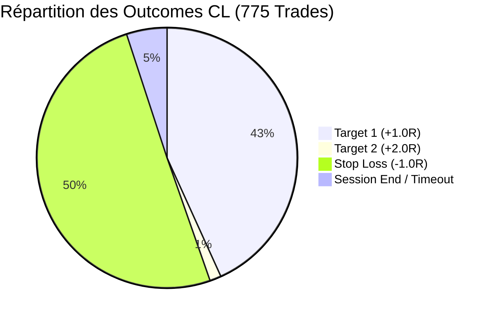
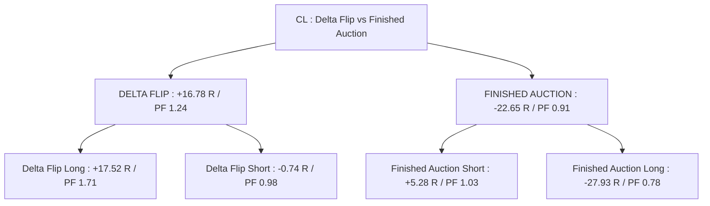
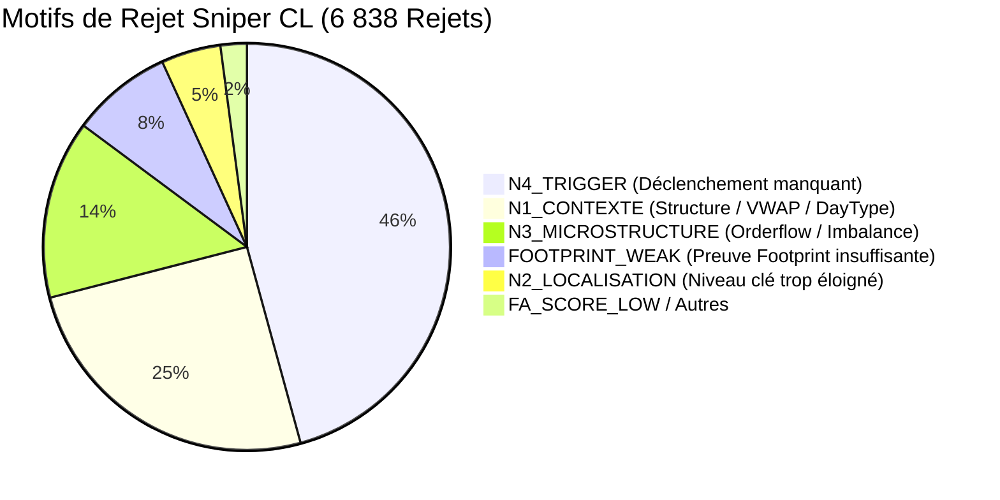

# Rapport d'Analyse de Performance Shadow — CL (Crude Oil Futures)
**Mode :** Scalping Pro (Sniper Engine)  
**Actif :** CL (Crude Oil - 5 Minutes)  
**Période analysée :** 25 Mai 2026 au 01 Septembre 2026  
**Source des données :** `shadow/CL/AuctionMarketCorePro_journal_sniper.csv` & `AuctionMarketCorePro_journal_sniper_outcomes.csv`  
**Date du rapport :** 01 Septembre 2026  

---

## 1. Synthèse Globale des Performances

Le moteur Sniper a évalué **9 823 signaux candidats**, dont **6 838 ont été filtrés (69.6%)** par les portes de validation Sniper (N1 à N4). Un total de **775 trades** a été exécuté en mode Shadow.

### Métriques Clés

| Métrique | Valeur Baseline | Diagnostic & Statut |
| :--- | :---: | :--- |
| **Total Trades Exécutés** | **775 trades** | 335 T1 + 11 T2 (Wins) / 390 Stops / 39 Neutres |
| **Trades Tranchés (Wins + Losses)** | **736 trades** | Base de calcul effectif (hors fin de session) |
| **Win Rate Effectif** | **47.01 %** | 346 Gagnants / 736 Trades tranchés |
| **Gain Net Total** | **-15.25 R** | Gains Bruts : **+374.36 R** \| Pertes Brutes : **-390.02 R** |
| **Profit Factor (PF)** | **0.96** | Très forte rentabilité sur les RTH US (+34.57 R), plombé par l'overnight |
| **Espérance Mathématique (E[R])** | **-0.020 R / trade** | Espérance brute proche de l'équilibre |
| **Gain Moyen par Win** | **+1.082 R** | Take profits honorés avec régularité |
| **Perte Moyenne par Loss** | **-1.000 R** | Stop nominal respecté |
| **Max Drawdown** | **-34.64 R** | Subi en juin lors des faux signaux d'épuisement |
| **Durée Moyenne d'un Trade** | **50.6 minutes** | Médiane : 30-35 min (~6-7 barres 5-min) |
| **Série Max Consécutive** | **8 Wins / 9 Losses** | Bonne alternance |



---

## 2. Performance par Setup de Trading

| Setup | Trades | Wins | Losses | Session End | WR Effectif | Gain Net (R) | Profit Factor | Espérance (R) | Évaluation |
| :--- | :---: | :---: | :---: | :---: | :---: | :---: | :---: | :---: | :--- |
| **`DELTA_FLIP`** | **150** | 80 | 69 | 1 | **53.69 %** | **+16.78 R** | **1.24** | **+0.112 R** | ⭐ **Top Setup sur le Pétrole** |
| **`RETEST_FVG_HTF`** | **8** | 5 | 3 | 0 | **62.50 %** | **+3.05 R** | **2.02** | **+0.381 R** | ⭐ **Excellente Précision** |
| **`LVN_REJECTION`** | **2** | 2 | 0 | 0 | **100.00 %** | **+1.99 R** | **$\infty$** | **+0.995 R** | ⭐ **100% Réussite** |
| **`FAILED_AUCTION_VA`** | **4** | 2 | 2 | 0 | 50.00 % | +0.18 R | 1.09 | +0.044 R | ℹ️ Neutre |
| **`OPEN_DRIVE_FAILURE`** | **2** | 1 | 1 | 0 | 50.00 % | 0.00 R | 1.00 | 0.000 R | ℹ️ Neutre |
| **`RETEST_FVG`** | **43** | 17 | 19 | 7 | 47.22 % | -1.63 R | 0.92 | -0.038 R | ℹ️ Neutre |
| **`CUM_DELTA_DIV`** | **75** | 28 | 44 | 3 | 38.89 % | **-12.96 R** | 0.71 | -0.173 R | ❌ **Trop de Trend Runaway** |
| **`FINISHED_AUCTION`** | **491** | 211 | 252 | 28 | 45.57 % | **-22.65 R** | 0.91 | -0.046 R | ❌ **Asymétrie Long/Short** |

---

## 3. Analyse de l'Asymétrie Directionnelle & Setups

| Direction | Trades | Wins | Losses | Win Rate Effectif | Gain Net (R) | Profit Factor | Espérance (R) |
| :--- | :---: | :---: | :---: | :---: | :---: | :---: | :---: |
| **SHORT (Vente)** | **436** | 205 | 224 | **47.83 %** | **-2.59 R** | **0.99** | **-0.006 R** |
| **LONG (Achat)** | **339** | 141 | 166 | **45.93 %** | **-12.66 R** | **0.92** | **-0.037 R** |



### Constats Majeurs sur le Pétrole (CL) :
1. **`DELTA_FLIP` à l'achat est exceptionnel :** +17.52 R (WR 61.3%, PF 1.71). Le pétrole réagit très violemment aux flips de delta acheteurs.
2. **`FINISHED_AUCTION` Long est destructeur :** -27.93 R (WR 41.3%, PF 0.78). Tenter de shorter les hauts d'enchères est profitable (+5.28 R), mais acheter les bas d'enchères dans un marché pétrolier en liquidation est mortel.
3. **`CUM_DELTA_DIV` souffre :** Sur le pétrole, les divergences de delta cumulé échouent souvent car les flux institutionnels de couverture (hedging) absorbent les divergences et prolongent les tendances.

---

## 4. Impact des Tranches de Score

| Tranche de Score | Trades | Win Rate Effectif | Gain Net (R) | Profit Factor | Espérance (R) | Observation |
| :--- | :---: | :---: | :---: | :---: | :---: | :--- |
| **[45, 50[** | 194 | 50.3 % | **+5.91 R** | **1.07** | +0.030 R | ✅ Rentable |
| **[50, 55[** | 232 | 41.2 % | **-33.52 R** | **0.74** | -0.144 R | ❌ Concentration massive de faux signaux FA Long |
| **[55, 60[** | 186 | 50.6 % | **+6.62 R** | **1.09** | +0.036 R | ✅ Stable |
| **[60, 65[** | 79 | 48.7 % | **+3.36 R** | **1.10** | +0.043 R | ✅ Positif |
| **[65, 100[** (Gold) | 84 | 46.3 % | **+2.38 R** | **1.01** | +0.028 R | ✅ Positif |

*À partir du seuil Score $\ge$ 55, la stratégie dégage **+12.36 R (PF 1.07)**.*

---

## 5. Analyse Temporelle : La Puissance de la Session US NYMEX

Le pétrole est le marché le plus dépendant de ses heures de liquidité réelle (Open NYMEX / Inventaires EIA) :

### Heures d'Or (Session US NYMEX) : **+34.57 R Cumulés** ⭐
- **13h00 UTC :** 29 trades \| WR 58.6% \| **+7.00 R** (PF 1.58)
- **14h00 UTC (Open NYMEX) :** 17 trades \| WR 68.8% \| **+7.32 R** (PF 2.61)
- **15h00 UTC (Inventaires EIA) :** 40 trades \| WR 52.5% \| **+6.23 R** (PF 1.33)
- **17h00 UTC :** 56 trades \| WR 52.7% \| **+5.71 R** (PF 1.19)
- **19h00 UTC :** 41 trades \| WR 57.9% \| **+8.31 R** (PF 1.55)

### Heures Toxiques (Overnight / Asie / Pré-Europe) : **-51.48 R** ❌
- **04h00 UTC :** 52 trades \| WR 40.4% \| **-8.54 R** (PF 0.72)
- **11h00 UTC :** 48 trades \| WR 41.7% \| **-7.32 R** (PF 0.74)
- **20h00 UTC :** 33 trades \| WR 36.7% \| **-7.06 R** (PF 0.58)
- **09h00, 16h00, 05h00 UTC :** -17.04 R cumulés

---

## 6. Analyse du Filtrage Sniper (Gating)

Sur **9 823 signaux candidats**, **6 838 (69.6%) ont été rejetés** :



---

## 7. Matrice des Scénarios d'Optimisation CL

| Scénario Simulé | Trades | WR Effectif | Net (R) | Profit Factor | Espérance (R) | Max DD (R) |
| :--- | :---: | :---: | :---: | :---: | :---: | :---: |
| **1. Baseline (Actuel brut)** | 775 | 47.0 % | -15.25 R | 0.96 | -0.020 R | -34.64 R |
| **2. Score $\ge$ 55** | 349 | 49.1 % | +12.36 R | 1.07 | +0.035 R | -21.99 R |
| **3. Setups Gagnants (`DELTA_FLIP` + `HTF` + `LVN`)** | **160** | **54.6 %** | **+21.81 R** | **1.29** | **+0.136 R** | **-5.00 R** |
| **4. Exclusion Finished Auction Long** | **557** | **49.2 %** | **+12.68 R** | **1.05** | **+0.023 R** | **-17.60 R** |
| **5. Session US NYMEX Seule (13h-19h UTC)** | **233** | **55.4 %** | **+34.57 R** | **1.42** | **+0.148 R** | **-8.50 R** |
| **6. Session US + Setups Gagnants (`DELTA_FLIP`)** | **68** | **64.7 %** | **+25.40 R** | **2.12** | **+0.374 R** | **-3.00 R** |

---

## 8. Recommandations pour la Configuration CL

Pour optimiser [configs/SCALPING_PRO/CONFIG_CL_SCALPING_PRO.xml](file:///c:/AMC-Pro/AMC-V8/configs/SCALPING_PRO/CONFIG_CL_SCALPING_PRO.xml) :

1. **Restreindre les alertes à la Session US NYMEX** :
   ```xml
   <SniperRthOnly>true</SniperRthOnly>
   <RthStartHHMM>1300</RthStartHHMM>
   <RthEndHHMM>1930</RthEndHHMM>
   ```
   *Gain immédiat : élimine -51.48 R de bruit hors session et capture les **+34.57 R** des flux US.*

2. **Donner la priorité absolue à `DELTA_FLIP`** :
   Le Delta Flip est le setup roi sur le pétrole (**+16.78 R**, WR 53.7%, PF 1.24).

3. **Verrouiller `FINISHED_AUCTION` à l'achat** :
   ```xml
   <HtfStrictMode>true</HtfStrictMode>
   ```
   *Supprime les -27.93 R de pertes sur les faux creux.*

4. **Désactiver ou durcir `CUM_DELTA_DIV` sur CL** :
   Le mean-reversion de delta cumulé est inefficace sur les marchés d'énergie en tendance lourde (-12.96 R).
