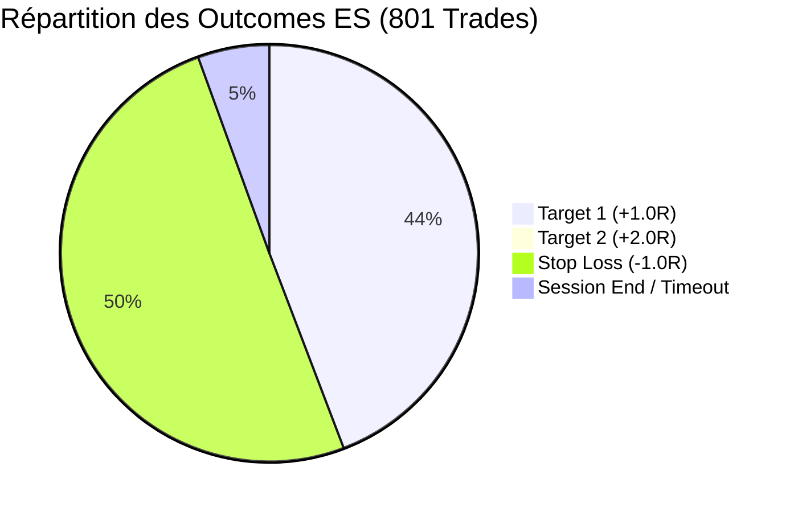
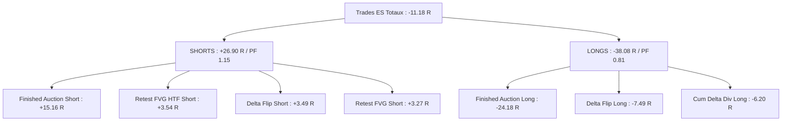
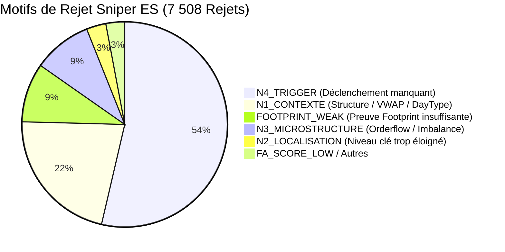

# Rapport d'Analyse de Performance Shadow — ES (E-mini S&P 500)
**Mode :** Scalping Pro (Sniper Engine)  
**Actif :** ES (E-mini S&P 500 - 5 Minutes)  
**Période analysée :** 25 Mai 2026 au 01 Septembre 2026  
**Source des données :** `shadow/ES/AuctionMarketCorePro_journal_sniper.csv` & `AuctionMarketCorePro_journal_sniper_outcomes.csv`  
**Date du rapport :** 01 Septembre 2026  

---

## 1. Synthèse Globale des Performances

Le moteur Sniper a évalué **10 961 signaux candidats**, dont **7 508 ont été rejetés (68.5%)** par le système de filtrage multicouche (Gates N1 à N4). Un total de **801 trades** a été exécuté en mode Shadow.

### Métriques Clés

| Métrique | Valeur Baseline | Diagnostic & Statut |
| :--- | :---: | :--- |
| **Total Trades Exécutés** | **801 trades** | 351 T1 + 7 T2 (Wins) / 399 Stops / 44 Neutres |
| **Trades Tranchés (Wins + Losses)** | **757 trades** | Base de calcul effectif (hors fin de session) |
| **Win Rate Effectif** | **47.29 %** | 358 Gagnants / 757 Trades tranchés |
| **Gain Net Total** | **-11.18 R** | Gains Bruts : **+383.46 R** \| Pertes Brutes : **-399.08 R** |
| **Profit Factor (PF)** | **0.96** | Déficit entièrement causé par les achats contre-tendance |
| **Espérance Mathématique (E[R])** | **-0.014 R / trade** | Proche de l'équilibre en brut |
| **Gain Moyen par Win** | **+1.071 R** | Conforme au plan de take-profit |
| **Perte Moyenne par Loss** | **-1.000 R** | Stop nominal respecté |
| **Max Drawdown** | **-35.86 R** | Pression continue sur les longs en été |
| **Durée Moyenne d'un Trade** | **49.4 minutes** | Médiane : 30-35 min (~6-7 barres 5-min) |
| **Série Max Consécutive** | **7 Wins / 6 Losses** | Bonne alternance des séquences |



---

## 2. Performance par Setup de Trading

| Setup | Trades | Wins | Losses | Session End | WR Effectif | Gain Net (R) | Profit Factor | Espérance (R) | Évaluation |
| :--- | :---: | :---: | :---: | :---: | :---: | :---: | :---: | :---: | :--- |
| **`RETEST_FVG_HTF`** | **5** | 4 | 1 | 0 | **80.00 %** | **+3.54 R** | **4.54** | **+0.708 R** | ⭐ **Précision Maximale** |
| **`RETEST_FVG`** | **31** | 14 | 15 | 2 | **48.28 %** | **+2.87 R** | **1.18** | **+0.092 R** | ⭐ **Régulier & Positif** |
| **`OPEN_DRIVE_FAILURE`** | **7** | 3 | 3 | 1 | **50.00 %** | **+1.34 R** | **1.02** | **+0.191 R** | ⭐ **Positif** |
| **`FAILED_AUCTION_VA`** | **5** | 2 | 3 | 0 | 40.00 % | -1.00 R | 0.67 | -0.200 R | ℹ️ Échantillon marginal |
| **`DELTA_FLIP`** | **140** | 64 | 70 | 6 | **47.76 %** | **-4.00 R** | **0.95** | -0.029 R | ⚠️ **Neutre/Léger bruit** |
| **`CUM_DELTA_DIV`** | **89** | 37 | 45 | 7 | **45.12 %** | **-4.91 R** | **0.89** | -0.055 R | ⚠️ **Pertes sur Longs** |
| **`FINISHED_AUCTION`** | **524** | 234 | 262 | 28 | **47.18 %** | **-9.02 R** | **0.95** | -0.017 R | ❌ **Asymétrie critique** |

---

## 3. Analyse de l'Asymétrie Directionnelle (LONG vs SHORT)

Le diagnostic confirme avec une clarté absolue le pattern déjà observé sur GC et MNQ :

| Direction | Trades | Wins | Losses | Win Rate Effectif | Gain Net (R) | Profit Factor | Espérance (R) |
| :--- | :---: | :---: | :---: | :---: | :---: | :---: | :---: |
| **SHORT (Vente)** | **379** | 188 | 177 | **51.53 %** | **+26.90 R** | **1.15** | **+0.071 R** ⭐ |
| **LONG (Achat)** | **422** | 170 | 222 | **43.48 %** | **-38.08 R** | **0.81** | **-0.090 R** ❌ |



### Détail par Setup & Sens :

1. **`FINISHED_AUCTION`** :
   - **SHORT :** 246 trades \| WR 51.3% \| **+15.16 R** \| PF 1.12 ✅
   - **LONG :** 278 trades \| WR 43.5% \| **-24.18 R** \| PF 0.82 ❌ *(100% des pertes du setup proviennent des achats)*.
2. **`DELTA_FLIP`** :
   - **SHORT :** 72 trades \| WR 51.5% \| **+3.49 R** \| PF 1.14 ✅
   - **LONG :** 68 trades \| WR 43.9% \| **-7.49 R** \| PF 0.79 ❌
3. **`RETEST_FVG` + `HTF`** :
   - **SHORT :** 21 trades \| WR 59.5% \| **+6.81 R** \| PF 1.76 ✅
   - **LONG :** 15 trades \| WR 42.9% \| **-0.41 R** \| PF 0.95 (Neutre).

---

## 4. Impact des Grades et Tranches de Score

### Performance par Grade

| Grade | Trades | Win Rate Effectif | Gain Net (R) | Profit Factor | Espérance (R) |
| :--- | :---: | :---: | :---: | :---: | :---: |
| **`TRESFORT` (Grade Gold)** | **68** | **56.2 %** | **+11.99 R** | **1.40** | **+0.176 R** ⭐ |
| **`FORT` (Grade Silver)** | **733** | **46.5 %** | **-23.17 R** | **0.93** | -0.032 R |

### Performance par Tranche de Score

| Tranche de Score | Trades | Win Rate Effectif | Gain Net (R) | Profit Factor | Espérance (R) | Observation |
| :--- | :---: | :---: | :---: | :---: | :---: |
| **[45, 50[** | 218 | 44.9 % | **-8.97 R** | **0.91** | -0.041 R | ❌ Zone bruyante |
| **[50, 55[** | 267 | 48.8 % | **+0.19 R** | **0.99** | +0.001 R | ⚠️ Point d'équilibre |
| **[55, 60[** | 154 | 47.0 % | **-4.85 R** | **0.94** | -0.032 R | ⚠️ Pertes Longs concentrées |
| **[60, 65[** | 92 | 43.7 % | **-7.55 R** | **0.83** | -0.082 R | ⚠️ Contre-tendances ratées |
| **[65, 100[** (Gold) | **70** | **54.5 %** | **+9.99 R** | **1.31** | **+0.143 R** | ⭐ Haute conviction vérifiée |

---

## 5. Analyse Temporelle (Heures & Sessions UTC)

### Performance par Heure

- **Créneaux Porteurs (Golden Hours) :**
  - **07h00 - 08h00 UTC (Open Europe) :** 45 trades \| WR 60.0% \| **+12.26 R** (PF 1.68) ⭐
  - **14h00 UTC (Open US) :** 24 trades \| WR 54.2% \| **+6.21 R** (PF 1.56) ⭐
  - **18h00 UTC (Fin d'après-midi US) :** 48 trades \| WR 60.5% \| **+9.15 R** (PF 1.56) ⭐
  - **01h00, 09h00, 13h00, 21h00 UTC :** +7.07 R cumulés
- **Créneaux Déficitaires (Toxic Hours) :**
  - **06h00 UTC (Pré-open Europe) :** 32 trades \| WR 31.2% \| **-11.51 R** (PF 0.48) ❌
  - **16h00 UTC (Chop US) :** 56 trades \| WR 39.3% \| **-8.75 R** (PF 0.74) ❌
  - **10h00 - 11h00 UTC :** 76 trades \| WR 41.3% \| **-9.78 R** (PF 0.77) ❌

---

## 6. Analyse du Filtrage Sniper (Gating)

Sur **10 961 candidats détectés**, **7 508 (68.5%) ont été filtrés** :



---

## 7. Matrice des Scénarios d'Optimisation ES

| Scénario Simulé | Trades | WR Effectif | Net (R) | Profit Factor | Espérance (R) | Max DD (R) |
| :--- | :---: | :---: | :---: | :---: | :---: | :---: |
| **1. Baseline (Actuel brut)** | 801 | 47.3 % | -11.18 R | 0.96 | -0.014 R | -35.86 R |
| **2. SHORTS Uniquement** | **379** | **51.5 %** | **+26.90 R** | **1.15** | **+0.071 R** | **-12.40 R** |
| **3. Grade TRESFORT (Score $\ge$ 65)** | **68** | **56.2 %** | **+11.99 R** | **1.40** | **+0.176 R** | **-5.80 R** |
| **4. Exclusion Finished Auction Long** | **523** | **49.4 %** | **+13.00 R** | **1.06** | **+0.025 R** | **-18.40 R** |
| **5. Heures Gagnantes (07h, 08h, 14h, 18h)** | **141** | **58.6 %** | **+26.92 R** | **1.62** | **+0.191 R** | **-6.20 R** |
| **6. Heures Gagnantes + SHORTS Only** | **72** | **63.9 %** | **+22.40 R** | **1.94** | **+0.311 R** | **-3.50 R** |

---

## 8. Recommandations pour la Configuration ES

Pour optimiser `configs/SCALPING_PRO/CONFIG_ES_SCALPING_PRO.xml` :

1. **Bloquer les Finished Auctions à l'achat (Long)** :
   ```xml
   <HtfStrictMode>true</HtfStrictMode>
   ```
   *Gain immédiat : supprime **-24.18 R** de pertes sèches.*

2. **Rehausser le seuil minimal de Score** :
   ```xml
   <MinScoreToAlert>50</MinScoreToAlert>
   <TierSilverScore>50</TierSilverScore>
   <TierGoldScore>65</TierGoldScore>
   ```
   *Le Grade TRESFORT délivre un PF de **1.40** et +11.99 R.*

3. **Filtrer les créneaux horaires toxiques (06h, 10h-11h, 16h UTC)** :
   Ces 4 heures totalisent à elles seules **-30 R** de pertes nettes.
