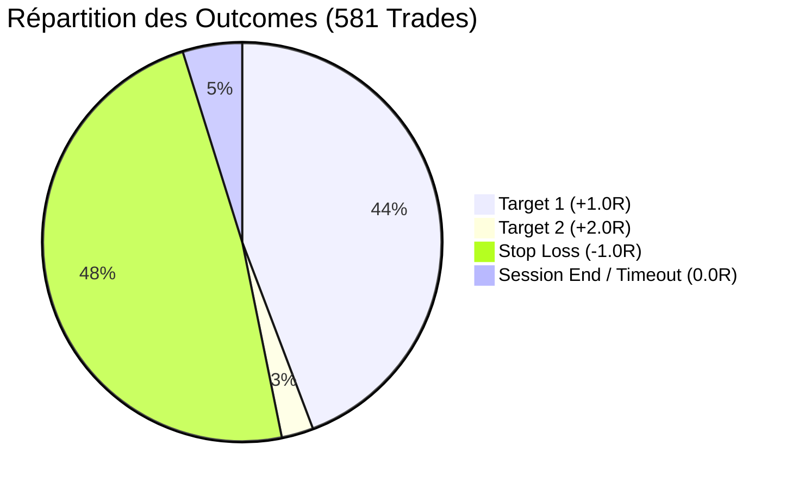
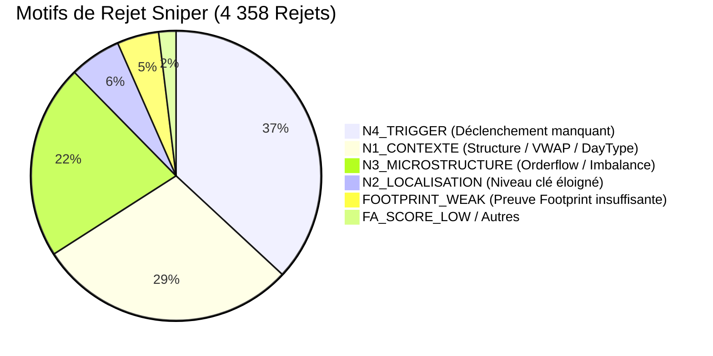

# Rapport d'Analyse de Performance Shadow — GC (Gold Futures)
**Mode :** Scalping Pro (Sniper Engine)  
**Actif :** GC (Gold Futures - 5 Minutes)  
**Période analysée :** 25 Mai 2026 au 01 Septembre 2026  
**Source des données :** `shadow/GC/AuctionMarketCorePro_journal_sniper.csv` & `AuctionMarketCorePro_journal_sniper_outcomes.csv`  
**Date du rapport :** 01 Septembre 2026  

---

## 1. Synthèse Globale des Performances

Le moteur de détection a capturé **7 178 signaux candidats**, dont **4 358 ont été filtrés (60.7%)** par les portes de validation Sniper (N1 à N4). Un total de **581 trades** a été exécuté en mode Shadow.

### Métriques Clés

| Métrique | Valeur Baseline | Diagnostic & Statut |
| :--- | :---: | :--- |
| **Total Trades Exécutés** | **581 trades** | 257 T1 + 15 T2 (Wins) / 281 Stops / 28 Fins de session |
| **Trades Tranchés (Wins + Losses)** | **553 trades** | Base de calcul effectif (hors timeout session) |
| **Win Rate Effectif** | **49.19 %** | 272 Gagnants / 553 Trades |
| **Gain Net Total** | **+28.17 R** | Gains Bruts : **+309.48 R** \| Pertes Brutes : **-281.00 R** |
| **Profit Factor (PF)** | **1.10** | Positif, mais fortement freiné par les signaux de faible score |
| **Espérance Mathématique (E[R])** | **+0.048 R / trade** | Espérance positive sur l'échantillon brut |
| **Gain Moyen par Win** | **+1.138 R** | R:R asymétrique favorable grâce aux sorties Target 2 |
| **Perte Moyenne par Loss** | **-1.000 R** | Stop Loss nominal respecté |
| **Max Drawdown** | **-15.80 R** | Survenu en début de période |
| **Peak Cumulatif** | **+38.31 R** | Atteint au trade #539 |
| **Durée Moyenne d'un Trade** | **51.3 minutes** | Médiane : 30-35 min (~6-7 barres 5-min) |
| **Série Max Consécutive** | **6 Wins / 8 Losses** | - |



---

## 2. Performance par Setup de Trading

| Setup | Trades | Wins | Losses | Session End | WR Effectif | Gain Net (R) | Profit Factor | Espérance (R) | Évaluation |
| :--- | :---: | :---: | :---: | :---: | :---: | :---: | :---: | :---: | :--- |
| **`CUM_DELTA_DIV`** | **118** | 63 | 47 | 8 | **57.27 %** | **+24.73 R** | **1.49** | **+0.210 R** | ⭐ **Setup Pilier** |
| **`RETEST_FVG`** | **41** | 20 | 17 | 4 | **54.05 %** | **+8.67 R** | **1.56** | **+0.212 R** | ⭐ **Très Solide** |
| **`RETEST_FVG_HTF`** | **4** | 3 | 1 | 0 | **75.00 %** | **+3.39 R** | **4.39** | **+0.847 R** | ⭐ **Haute Précision** |
| **`OPEN_DRIVE_FAILURE`** | **8** | 5 | 3 | 0 | **62.50 %** | **+2.87 R** | **1.96** | **+0.358 R** | ⭐ **Excellent Ratio** |
| **`FINISHED_AUCTION`** | **273** | 122 | 140 | 11 | **46.56 %** | **-2.58 R** | **0.99** | -0.009 R | ⚠️ **Asymétrie Long/Short** |
| **`DELTA_FLIP`** | **132** | 58 | 70 | 4 | **45.31 %** | **-6.88 R** | **0.90** | -0.052 R | ❌ **Trop de Bruit** |
| **`FAILED_AUCTION_VA`** | **3** | 1 | 2 | 0 | 33.33 % | -1.00 R | 0.50 | -0.333 R | ℹ️ Échantillon marginal |
| **`LVN_REJECTION`** | **1** | 0 | 1 | 0 | 0.00 % | -1.00 R | 0.00 | -1.000 R | ℹ️ Échantillon marginal |
| **`STACKED_IMB_RETEST`** | **1** | 0 | 0 | 1 | 0.00 % | -0.02 R | 0.00 | -0.019 R | ℹ️ Échantillon marginal |

---

## 3. Analyse de l'Asymétrie Directionnelle (LONG vs SHORT)

Une dichotomie critique apparaît entre les deux sens d'intervention :

| Direction | Trades | Wins | Losses | Win Rate Effectif | Gain Net (R) | Profit Factor | Espérance (R) |
| :--- | :---: | :---: | :---: | :---: | :---: | :---: | :---: |
| **SHORT (Vente)** | **297** | 164 | 133 | **55.24 %** | **+52.39 R** | **1.41** | **+0.176 R** |
| **LONG (Achat)** | **284** | 108 | 148 | **42.19 %** | **-24.22 R** | **0.84** | **-0.085 R** |

### Détail par Setup & Direction

1. **`FINISHED_AUCTION`** :
   - **SHORT** : 120 trades \| WR 56.4% \| **+26.59 R** \| PF 1.51 ✅
   - **LONG** : 153 trades \| WR 38.6% \| **-29.17 R** \| PF 0.69 ❌ *(Acheter les bas d'enchères contre le flux GC a créé 100% du déficit)*.
2. **`CUM_DELTA_DIV`** :
   - **SHORT** : 80 trades \| WR 62.3% \| **+25.17 R** \| PF 1.87 ✅
   - **LONG** : 38 trades \| WR 45.5% \| **-0.44 R** \| PF 0.89 (Neutre).
3. **`RETEST_FVG`** :
   - **SHORT** : 19 trades \| WR 55.6% \| **+3.77 R** \| PF 1.54 ✅
   - **LONG** : 22 trades \| WR 52.6% \| **+4.90 R** \| PF 1.58 ✅ *(Robuste dans les deux sens)*.

---

## 4. Impact des Seuils de Score

L'analyse par tranche de score montre que les signaux sous le seuil de 50 agissent comme un frein majeur :

| Tranche de Score | Trades | Win Rate Effectif | Gain Net (R) | Profit Factor | Espérance (R) | Observation |
| :--- | :---: | :---: | :---: | :---: | :---: | :--- |
| **[45, 50[** | 142 | 41.4 % | **-21.57 R** | **0.73** | -0.152 R | ❌ **Zone destructrice de valeur** |
| **[50, 55[** | 171 | 51.2 % | **+18.58 R** | **1.23** | +0.109 R | ✅ Seuil de rentabilité avéré |
| **[55, 60[** | 133 | 50.4 % | **+10.77 R** | **1.18** | +0.081 R | ✅ Régulier |
| **[60, 65[** | 65 | 55.7 % | **+13.63 R** | **1.50** | +0.210 R | ⭐ Très haute performance |
| **[65, 100[** (Gold) | 70 | 51.4 % | **+6.76 R** | **1.20** | +0.097 R | ✅ Haute conviction |

> [!NOTE]
> Le passage du filtre `MinScoreToAlert` de **45 à 50** élimine 142 trades toxiques et transforme le PnL global de **+28.17 R à +49.74 R**.

---

## 5. Analyse Temporelle (Heures & Sessions UTC)

### Performance par Heure

- **Créneaux Porteurs (Golden Hours) :**
  - **11h00 UTC :** 34 trades \| WR 61.8% \| **+9.19 R** (PF 1.71)
  - **17h00 UTC :** 32 trades \| WR 61.3% \| **+10.56 R** (PF 1.87)
  - **02h00 UTC (Asie) :** 24 trades \| WR 62.5% \| **+8.11 R** (PF 1.90)
  - **14h00 UTC & 19h00 UTC :** 52 trades \| **+11.85 R** cumulés
- **Créneaux Déficitaires (Toxic Hours) :**
  - **08h00 UTC (Open Londres) :** 18 trades \| WR 22.2% \| **-8.46 R** (PF 0.40)
  - **18h00 UTC (Transition Globex CME) :** 25 trades \| WR 36.4% \| **-5.54 R** (PF 0.61)
  - **01h00 UTC & 06h00 UTC :** 37 trades \| **-8.44 R** cumulés

### Performance par Jour de Semaine

- **Mercredi :** 140 trades \| WR 51.5% \| **+18.43 R** (PF 1.26)
- **Vendredi :** 93 trades \| WR 49.4% \| **+6.21 R** (PF 1.14)
- **Mardi :** 107 trades \| WR 48.6% \| **+3.33 R** (PF 1.07)
- **Lundi :** 105 trades \| WR 48.5% \| **+2.53 R** (PF 1.07)
- **Jeudi :** 136 trades \| WR 47.6% \| **-2.32 R** (PF 0.97)

### Performance Mensuelle

- **Mai 2026 (fin) :** 36 trades \| **+3.05 R** (PF 1.17)
- **Juin 2026 :** 165 trades \| **+9.26 R** (PF 1.11)
- **Juillet 2026 :** 163 trades \| **+11.18 R** (PF 1.15)
- **Août 2026 :** 209 trades \| **+5.26 R** (PF 1.06)
- **Septembre 2026 (début) :** 8 trades \| **-0.58 R** (PF 0.88)

---

## 6. Analyse du Filtrage Sniper (Gating)

Sur les **7 178 signaux candidats détectés**, **4 358 signaux (60.7%)** ont été invalidés par les portes strictes :



---

## 7. Matrice des Scénarios d'Optimisation

| Scénario Simulé | Trades | WR Effectif | Net (R) | Profit Factor | Espérance (R) | Max DD (R) |
| :--- | :---: | :---: | :---: | :---: | :---: | :---: |
| **1. Baseline (Actuel)** | 581 | 49.2 % | +28.17 R | 1.10 | +0.048 R | -15.80 R |
| **2. Seuil Score $\ge$ 50** | **439** | **51.7 %** | **+49.74 R** | **1.25** | **+0.113 R** | **-13.89 R** |
| **3. Seuil Score $\ge$ 60** | 135 | 53.4 % | +20.40 R | 1.33 | +0.151 R | -6.41 R |
| **4. Setups Gagnants Seuls (Score $\ge$ 50)** | 132 | 61.3 % | +44.22 R | 1.92 | +0.335 R | -5.82 R |
| **5. Score $\ge$ 50 + Filtre Heures Toxiques** | **340** | **56.1 %** | **+74.03 R** | **1.51** | **+0.218 R** | **-7.83 R** |
| **6. Setups Gagnants + Heures + Score $\ge$ 50** | **96** | **68.5 %** | **+50.20 R** | **2.70** | **+0.523 R** | **-3.00 R** |

*Note : Setups Gagnants = `CUM_DELTA_DIV`, `RETEST_FVG`, `RETEST_FVG_HTF`, `OPEN_DRIVE_FAILURE`.*

---

## 8. Recommandations pour la Configuration GC

Pour optimiser le fichier `configs/SCALPING_PRO/CONFIG_GC_SCALPING_PRO.xml` :

1. **Rehausser le Score Minimal** :
   ```xml
   <MinScoreToAlert>50</MinScoreToAlert>
   <TierSilverScore>50</TierSilverScore>
   ```
   *Gain immédiat : +21.57 R sauvés, PF passe de 1.10 à 1.25.*

2. **Désactiver `DELTA_FLIP` sur GC** :
   ```xml
   <EnableDeltaFlip>false</EnableDeltaFlip>
   ```
   *Évite 132 trades bruyants à espérance négative (-6.88 R).*

3. **Conditionner `FINISHED_AUCTION` aux Shorts ou à l'alignement HTF strict** :
   ```xml
   <HtfStrictMode>true</HtfStrictMode>
   ```
   *Bloque les contre-tendances acheteuses hasardeuses (-29.17 R).*

4. **Renforcer la pondération de `CUM_DELTA_DIV` & `RETEST_FVG`** :
   Ces deux configurations totalisent plus de **+33 R** de profit net avec un PF supérieur à 1.50.
