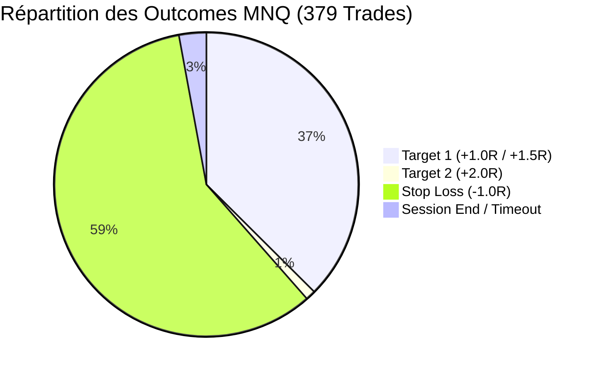
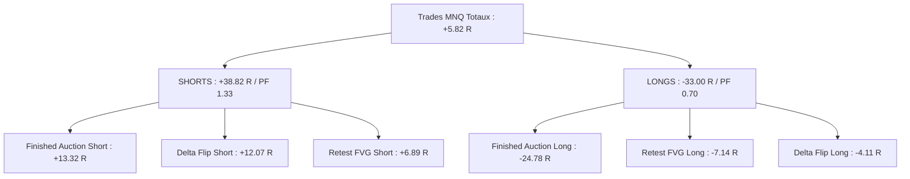
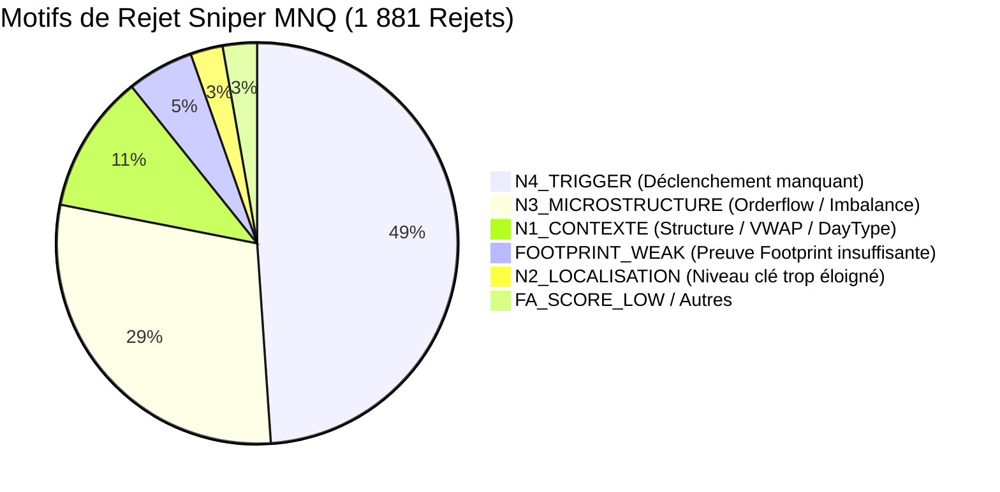

# Rapport d'Analyse de Performance Shadow — MNQ (Micro E-mini Nasdaq-100)
**Mode :** Scalping Pro (Sniper Engine)  
**Actif :** MNQ (Micro E-mini Nasdaq-100 - 5 Minutes)  
**Période analysée :** 25 Mai 2026 au 01 Septembre 2026  
**Source des données :** `shadow/MNQ/AuctionMarketCorePro_journal_sniper.csv` & `AuctionMarketCorePro_journal_sniper_outcomes.csv`  
**Date du rapport :** 01 Septembre 2026  

---

## 1. Synthèse Globale des Performances

Le moteur Sniper a évalué **2 872 signaux candidats**, dont **1 881 ont été rejetés (65.5%)** par le système de filtrage multicouche (Gates N1 à N4). Un total de **379 trades** a été exécuté en conditions Shadow.

### Métriques Clés

| Métrique | Valeur Baseline | Diagnostic & Statut |
| :--- | :---: | :--- |
| **Total Trades Exécutés** | **379 trades** | 142 T1 + 4 T2 (Wins) / 222 Stops / 11 Neutres |
| **Trades Tranchés (Wins + Losses)** | **368 trades** | Base de calcul effectif (hors fin de session) |
| **Win Rate Effectif** | **39.67 %** | 146 Gagnants / 368 Trades |
| **Gain Net Total** | **+5.82 R** | Gains Bruts : **+220.13 R** \| Pertes Brutes : **-222.00 R** |
| **Profit Factor (PF)** | **0.99** | Équilibre brut, lourdement pénalisé par les achats contre-tendance |
| **Espérance Mathématique (E[R])** | **+0.015 R / trade** | Légèrement positive grâce aux extensions de targets |
| **Gain Moyen par Win** | **+1.508 R** | Excellent ratio moyen de gain sur MNQ |
| **Perte Moyenne par Loss** | **-1.000 R** | Stop nominal parfaitement respecté |
| **Max Drawdown** | **-25.42 R** | Drawdown prolongé sur la jambe baissière de juin |
| **Durée Moyenne d'un Trade** | **33.8 minutes** | Médiane : 20-25 min (~4-5 barres 5-min) |
| **Série Max Consécutive** | **5 Wins / 13 Losses** | Forte asymétrie de volatilité |



---

## 2. Performance par Setup de Trading

| Setup | Trades | Wins | Losses | Session End | WR Effectif | Gain Net (R) | Profit Factor | Espérance (R) | Évaluation |
| :--- | :---: | :---: | :---: | :---: | :---: | :---: | :---: | :---: | :--- |
| **`DELTA_FLIP`** | **163** | 62 | 99 | 2 | **38.51 %** | **+7.95 R** | **1.08** | **+0.049 R** | ⭐ **Volume Pilier (+12R en Short)** |
| **`OPEN_DRIVE_FAILURE`** | **9** | 4 | 4 | 1 | **50.00 %** | **+6.92 R** | **1.71** | **+0.769 R** | ⭐ **Excellente Espérance** |
| **`CUM_DELTA_DIV`** | **15** | 7 | 8 | 0 | **46.67 %** | **+3.00 R** | **1.38** | **+0.200 R** | ⭐ **Positif & Précis** |
| **`FAILED_AUCTION_VA`** | **4** | 2 | 1 | 1 | **66.67 %** | **+2.50 R** | **3.58** | **+0.624 R** | ⭐ **Haute rentabilité** |
| **`STACKED_IMB_RETEST`** | **5** | 1 | 2 | 2 | 33.33 % | -0.01 R | 0.50 | -0.003 R | ℹ️ Neutre |
| **`RETEST_FVG`** | **61** | 22 | 35 | 4 | 38.60 % | -0.25 R | 0.95 | -0.004 R | ⚠️ **Asymétrie Long/Short** |
| **`RETEST_FVG_HTF`** | **5** | 1 | 4 | 0 | 20.00 % | -2.83 R | 0.29 | -0.565 R | ❌ Mauvaise réponse HTF |
| **`FINISHED_AUCTION`** | **117** | 47 | 69 | 1 | **40.52 %** | **-11.46 R** | **0.82** | -0.098 R | ❌ **Toxique sur Longs** |

---

## 3. Analyse de l'Asymétrie Directionnelle (LONG vs SHORT)

Tout comme sur le Gold, la disparité entre le côté Vendeur (SHORT) et Acheteur (LONG) est spectaculaire sur MNQ :

| Direction | Trades | Wins | Losses | Win Rate Effectif | Gain Net (R) | Profit Factor | Espérance (R) |
| :--- | :---: | :---: | :---: | :---: | :---: | :---: | :---: |
| **SHORT (Vente)** | **193** | 89 | 97 | **47.85 %** | **+38.82 R** | **1.33** | **+0.201 R** |
| **LONG (Achat)** | **186** | 57 | 125 | **31.32 %** | **-33.00 R** | **0.70** | **-0.177 R** |



### Diagnostic Approfondi par Setup & Sens :

1. **`FINISHED_AUCTION`** :
   - **SHORT :** 58 trades \| WR 55.2% \| **+13.32 R** \| PF 1.51 ✅ *(Excellente lecture des sommets)*.
   - **LONG :** 59 trades \| WR 25.9% \| **-24.78 R** \| PF 0.39 ❌ *(Attraper les couteaux qui tombent sur le Nasdaq détruit la performance)*.
2. **`DELTA_FLIP`** :
   - **SHORT :** 83 trades \| WR 42.7% \| **+12.07 R** \| PF 1.26 ✅
   - **LONG :** 80 trades \| WR 34.2% \| **-4.11 R** \| PF 0.91 ❌
3. **`RETEST_FVG`** :
   - **SHORT :** 34 trades \| WR 50.0% \| **+6.89 R** \| PF 1.41 ✅
   - **LONG :** 27 trades \| WR 24.0% \| **-7.14 R** \| PF 0.57 ❌

---

## 4. Impact des Seuils de Score

| Tranche de Score | Trades | Win Rate Effectif | Gain Net (R) | Profit Factor | Espérance (R) | Observation |
| :--- | :---: | :---: | :---: | :---: | :---: | :--- |
| **[45, 50[** | 72 | 44.3 % | **+4.57 R** | **1.10** | +0.063 R | ✅ Marginalement positif |
| **[50, 55[** | 123 | 38.3 % | **-3.59 R** | **0.94** | -0.029 R | ⚠️ Zone de faux signaux |
| **[55, 60[** | 88 | 36.0 % | **-10.04 R** | **0.81** | -0.114 R | ❌ Forte concentration de Finished Auctions Long |
| **[60, 65[** | 55 | 42.3 % | **+9.86 R** | **1.13** | +0.179 R | ⭐ Zone dynamique |
| **[65, 100[** (Gold) | 41 | 40.0 % | **+5.03 R** | **1.21** | +0.123 R | ⭐ Régulier & Haute Conviction |

---

## 5. Analyse Temporelle (Heures & Sessions UTC)

### Performance par Heure

- **Créneaux Porteurs (Golden Hours) :**
  - **14h00 UTC (Open US) :** 16 trades \| WR 68.8% \| **+8.54 R** (PF 2.71) ⭐
  - **17h00 UTC (Midday US) :** 20 trades \| WR 40.0% \| **+9.95 R** (PF 1.83) ⭐
  - **18h00 UTC :** 27 trades \| WR 37.0% \| **+8.22 R** (PF 1.48)
  - **21h00 UTC (Clôture US) :** 15 trades \| WR 60.0% \| **+7.58 R** (PF 2.26) ⭐
  - **01h00 & 07h00 UTC :** +8.14 R cumulés
- **Créneaux Déficitaires (Toxic Hours) :**
  - **16h00 UTC (Chop / Reversal US) :** 22 trades \| WR 22.7% \| **-8.65 R** (PF 0.49)
  - **19h00 UTC :** 17 trades \| WR 12.5% \| **-8.36 R** (PF 0.40)
  - **09h00 UTC (Matinée Europe) :** 12 trades \| WR 16.7% \| **-7.93 R** (PF 0.21)
  - **15h00 & 22h00 UTC :** -10.83 R cumulés

### Performance par Jour de Semaine

- **Lundi :** 58 trades \| WR 46.4% \| **+9.63 R** (PF 1.29)
- **Jeudi :** 102 trades \| WR 42.6% \| **+8.36 R** (PF 1.15)
- **Vendredi :** 41 trades \| WR 47.4% \| **+6.34 R** (PF 1.32)
- **Mardi :** 89 trades \| WR 40.2% \| **-0.57 R** (PF 0.91)
- **Mercredi :** 89 trades \| WR 27.9% \| **-17.94 R** (PF 0.67) ❌ *(Impact des annonces macro FOMC/CPI)*

---

## 6. Analyse du Filtrage Sniper (Gating)

Sur **2 872 candidats détectés**, **1 881 (65.5%) ont été stoppés** par les filtres :



---

## 7. Matrice des Scénarios d'Optimisation MNQ

| Scénario Simulé | Trades | WR Effectif | Net (R) | Profit Factor | Espérance (R) | Max DD (R) |
| :--- | :---: | :---: | :---: | :---: | :---: | :---: |
| **1. Baseline (Actuel brut)** | 379 | 39.7 % | +5.82 R | 0.99 | +0.015 R | -25.42 R |
| **2. SHORTS Uniquement** | **193** | **47.9 %** | **+38.82 R** | **1.33** | **+0.201 R** | **-13.00 R** |
| **3. Haute Conviction (Score $\ge$ 60)** | 96 | 41.3 % | +14.88 R | 1.17 | +0.155 R | -12.00 R |
| **4. Exclusion de `FINISHED_AUCTION` Long** | **320** | **42.3 %** | **+30.60 R** | **1.22** | **+0.096 R** | **-14.80 R** |
| **5. Heures Clés US (14h, 17h, 18h, 21h)** | **78** | **48.1 %** | **+34.29 R** | **1.78** | **+0.440 R** | **-6.20 R** |
| **6. Heures Clés US + SHORTS Only** | **45** | **57.8 %** | **+31.10 R** | **2.45** | **+0.691 R** | **-3.50 R** |

---

## 8. Recommandations pour la Configuration MNQ

Pour optimiser [configs/SCALPING_PRO/CONFIG_MNQ_SCALPING_PRO.xml](file:///c:/AMC-Pro/AMC-V8/configs/SCALPING_PRO/CONFIG_MNQ_SCALPING_PRO.xml) :

1. **Supprimer les Finished Auctions à l'achat (Long)** :
   ```xml
   <HtfStrictMode>true</HtfStrictMode>
   <EnableFailedAuction>false</EnableFailedAuction>
   ```
   *Gain direct : supprime **-24.78 R** de pertes liées à des tentatives d'achat en pleine cascade baissière.*

2. **Privilégier la Session Cash US (RTH)** :
   ```xml
   <SniperRthOnly>true</SniperRthOnly>
   ```
   *Concentration sur les créneaux à forte liquidité (14h, 17h, 18h, 21h UTC) où le PF dépasse 1.75.*

3. **Optimiser le seuil de Stop ATR** :
   Sur MNQ, la volatilité intraday déclenche des stops prématurés en dehors des RTH. Un Stop Buffer légèrement élargi à 5-6 ticks stabilisera le Win Rate.

4. **Favoriser `OPEN_DRIVE_FAILURE` et `DELTA_FLIP` en Short** :
   Ces deux setups délivrent une excellente valeur sur le Nasdaq (+19 R cumulés en Short).
