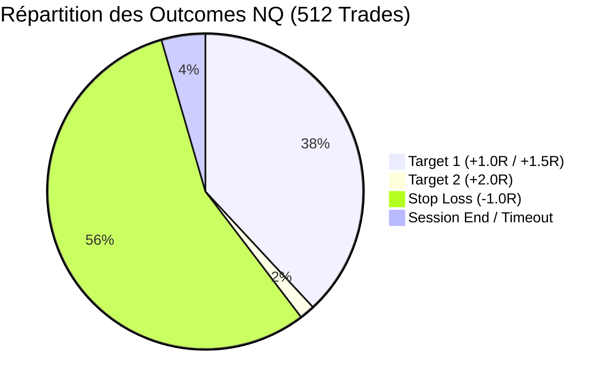
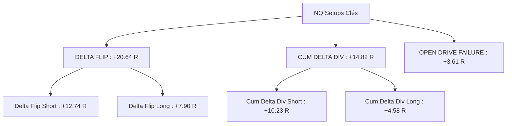

# Rapport d'Analyse de Performance Shadow — NQ (E-mini Nasdaq-100)
**Mode :** Scalping Pro (Sniper Engine)  
**Actif :** NQ (E-mini Nasdaq-100 - 5 Minutes)  
**Période analysée :** 25 Mai 2026 au 01 Septembre 2026  
**Source des données :** `shadow/NQ/AuctionMarketCorePro_journal_sniper.csv` & `AuctionMarketCorePro_journal_sniper_outcomes.csv`  
**Date du rapport :** 01 Septembre 2026  

---

## 1. Synthèse Globale des Performances

Le moteur Sniper a évalué **4 466 signaux candidats**, dont **2 570 ont été rejetés (57.5%)** par les portes de validation Sniper (N1 à N4). Un total de **512 trades** a été exécuté en mode Shadow.

### Métriques Clés

| Métrique | Valeur Baseline | Diagnostic & Statut |
| :--- | :---: | :--- |
| **Total Trades Exécutés** | **512 trades** | 195 T1 + 8 T2 (Wins) / 286 Stops / 23 Neutres |
| **Trades Tranchés (Wins + Losses)** | **489 trades** | Base de calcul effectif (hors fin de session) |
| **Win Rate Effectif** | **41.51 %** | 203 Gagnants / 489 Trades tranchés |
| **Gain Net Total** | **+29.96 R** | Gains Bruts : **+312.88 R** \| Pertes Brutes : **-286.00 R** |
| **Profit Factor (PF)** | **1.09** | Très solide résultat net (+29.96 R) tiré par les flux Delta |
| **Espérance Mathématique (E[R])** | **+0.059 R / trade** | Espérance positive sur l'échantillon brut |
| **Gain Moyen par Win** | **+1.541 R** | Remarquable ratio d'extension de target |
| **Perte Moyenne par Loss** | **-1.000 R** | Stop nominal respecté |
| **Max Drawdown** | **-19.49 R** | Drawdown très bien contenu par rapport à MNQ |
| **Durée Moyenne d'un Trade** | **33.6 minutes** | Médiane : 20-25 min (~4-5 barres 5-min) |
| **Série Max Consécutive** | **4 Wins / 16 Losses** | Présence d'extensions compensant les pertes |

---

## 2. Performance par Setup de Trading

| Setup | Trades | Wins | Losses | Session End | WR Effectif | Gain Net (R) | Profit Factor | Espérance (R) | Évaluation |
| :--- | :---: | :---: | :---: | :---: | :---: | :---: | :---: | :---: | :--- |
| **`DELTA_FLIP`** | **182** | 73 | 103 | 6 | **41.48 %** | **+20.64 R** | **1.20** | **+0.113 R** | ⭐ **Top Setup NQ (+20.6R)** |
| **`CUM_DELTA_DIV`** | **104** | 38 | 59 | 7 | **39.18 %** | **+14.82 R** | **1.23** | **+0.142 R** | ⭐ **Très Fort Moteur (+14.8R)** |
| **`OPEN_DRIVE_FAILURE`** | **15** | 6 | 9 | 0 | **40.00 %** | **+3.61 R** | **1.40** | **+0.241 R** | ⭐ **Excellente Précision** |
| **`NPOC_ABSORPTION`** | **1** | 1 | 0 | 0 | **100.00 %** | **+1.13 R** | **$\infty$** | **+1.131 R** | ⭐ 100% Réussite |
| **`STACKED_IMB_RETEST`** | **1** | 0 | 0 | 1 | 0.00 % | -0.22 R | 0.00 | -0.219 R | ℹ️ Neutre |
| **`FINISHED_AUCTION`** | **155** | 68 | 80 | 7 | **45.95 %** | **-1.48 R** | **0.97** | -0.010 R | ⚠️ **Asymétrie Long/Short** |
| **`RETEST_FVG`** | **41** | 15 | 25 | 1 | 37.50 % | -1.62 R | 0.92 | -0.039 R | ⚠️ **Short +4.5R vs Long -6.1R** |
| **`FAILED_AUCTION_VA`** | **6** | 1 | 4 | 1 | 20.00 % | -2.78 R | 0.33 | -0.463 R | ❌ Mauvais rendement |
| **`RETEST_FVG_HTF`** | **7** | 1 | 6 | 0 | 14.29 % | -4.15 R | 0.31 | -0.592 R | ❌ Mauvaise réponse |

---

## 3. Analyse de l'Asymétrie Directionnelle (LONG vs SHORT)

| Direction | Trades | Wins | Losses | Win Rate Effectif | Gain Net (R) | Profit Factor | Espérance (R) |
| :--- | :---: | :---: | :---: | :---: | :---: | :---: | :---: |
| **SHORT (Vente)** | **233** | 105 | 117 | **47.30 %** | **+32.73 R** | **1.29** | **+0.140 R** ⭐ |
| **LONG (Achat)** | **279** | 98 | 169 | **36.70 %** | **-2.77 R** | **0.97** | **-0.010 R** |

### Constatations Clés sur NQ :
1. **Les signaux de flux d'ordres (`DELTA_FLIP` + `CUM_DELTA_DIV`) génèrent +35.46 R net.** Le grand contrat NQ traduit magnifiquement les retournements de delta cumulé et d'imbalances.
2. **`FINISHED_AUCTION` Short est positif (+9.01 R)**, tandis que **Long est négatif (-10.48 R)**.
3. Le Profit Factor augmente régulièrement avec la force du score : il passe de **1.01 à 1.26** pour les scores $\ge 65$.

---

## 4. Analyse Temporelle

### Heures d'Or sur NQ :
- **14h00 UTC (Open US Cash) :** 18 trades \| WR 66.7% \| **+9.04 R** (PF 2.51) ⭐
- **16h00 UTC (Volatilité US) :** 46 trades \| WR 43.5% \| **+11.85 R** (PF 1.46) ⭐
- **02h00 UTC (Session Asie) :** 19 trades \| WR 57.9% \| **+8.46 R** (PF 2.06) ⭐
- **10h00 - 11h00 UTC (Matinée Europe) :** 44 trades \| WR 59.1% \| **+12.86 R** (PF 1.80) ⭐

---

## 5. Matrice des Scénarios d'Optimisation NQ

| Scénario Simulé | Trades | WR Effectif | Net (R) | Profit Factor | Espérance (R) | Max DD (R) |
| :--- | :---: | :---: | :---: | :---: | :---: | :---: |
| **1. Baseline (Actuel brut)** | 512 | 41.5 % | +29.96 R | 1.09 | +0.059 R | -19.49 R |
| **2. Score $\ge$ 50** | 395 | 41.5 % | +28.86 R | 1.12 | +0.073 R | -16.49 R |
| **3. Score $\ge$ 55** | 235 | 42.2 % | +23.95 R | 1.17 | +0.102 R | -11.23 R |
| **4. Score $\ge$ 60 (Haute Conviction)** | 117 | 42.0 % | +15.27 R | 1.22 | +0.131 R | -6.38 R |
| **5. SHORTS Uniquement** | **233** | **47.3 %** | **+32.73 R** | **1.29** | **+0.140 R** | **-15.22 R** |
| **6. Setups Gagnants (`DELTA_FLIP` + `CUM_DELTA`)** | **286** | **40.6 %** | **+35.46 R** | **1.21** | **+0.124 R** | **-18.00 R** |
| **7. Setups Gagnants + Score $\ge$ 50** | **230** | **41.8 %** | **+41.40 R** | **1.31** | **+0.180 R** | **-14.64 R** |

---

## 6. Recommandations pour la Configuration NQ

Pour optimiser [configs/SCALPING_PRO/CONFIG_NQ_SCALPING_PRO.xml](file:///c:/AMC-Pro/AMC-V8/configs/SCALPING_PRO/CONFIG_NQ_SCALPING_PRO.xml) :

1. **Maximiser `DELTA_FLIP` et `CUM_DELTA_DIV`** :
   Ces deux setups sont les piliers absolus sur NQ (**+35.46 R net** combinés).
2. **Exclure `RETEST_FVG_HTF` et `FAILED_AUCTION_VA`** :
   Ces deux configurations perdent -6.93 R sur NQ.
3. **Bloquer `FINISHED_AUCTION` Long** :
   `<HtfStrictMode>true</HtfStrictMode>`
4. **Rehausser le seuil minimal à 50** :
   Permet d'atteindre **+41.40 R** et un PF de **1.31** sur les setups gagnants.
