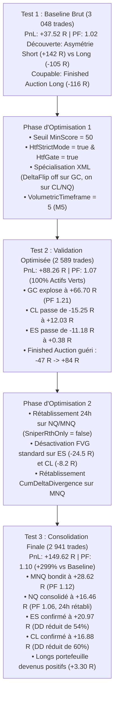

# AuctionMarketCore (AMC-V8)

**AuctionMarketCore** est le moteur institutionnel haute précision d'AMC-V8 pour **NinjaTrader 8**, articulé autour de deux modes opérationnels exclusifs et strictement étanches : **ScalpingPro** (intraday à haute confluence, 5 à 10 setups/session) et **Swing** (macro théorie des enchères, 1 à 4 setups majeurs/semaine). Les anciens presets génériques (`SCALPING`, `SNIPER`, `SCANNER`, `STANDARD`) ont été définitivement retirés du périmètre actif.

Le système fusionne la théorie des enchères (*Auction Market Theory*), le **Volume Profile institutionnel multi-périodes** (*Closed References* immuables Daily, Weekly, Monthly persistées sous SQLite), les **VWAP clôturés et dynamiques avec bandes d'écart-type ($SD \pm 1, \pm 2, \pm 3$)**, les nœuds de volume (**HVN / LVN**), l'analyse d'Order Flow (*Footprint / Delta / CVD Divergence*), la structure de marché (*Market Structure SMC / BOS / CHoCH / FVG*) et un moteur de risque quantitatif déterministe.

---

## 🚀 Dernières Mises à Jour & Nouveautés (Août / Septembre 2026)

### 1. Moteur Institutionnel Swing V8
* **Architecture Dédiée et Étanche** : Implémenté dans [`AuctionMarketCore.Swing.cs`](file:///c:/AMC-Pro/AMC-V8/AuctionMarketCore.Swing.cs) et [`AuctionMarketCore.Swing.Models.cs`](file:///c:/AMC-Pro/AMC-V8/AuctionMarketCore.Swing.Models.cs), le mode Swing s'active via `<TradingPreset>Swing</TradingPreset>` sans perturber le pipeline `ScalpingPro`.
* **7 Setups Institutionnels Macro AMT & SMC** :
  1. **`RejectExtreme`** : Rejet statistique violent des bandes $SD \pm 2 / \pm 3$ ou clôture hors Value Area avec bougie de confirmation.
  2. **`ValueReentry`** : Réintégration confirmée de la Value Area d'une période clôturée (Daily/Weekly/Monthly) avec visée du POC opposé.
  3. **`BreakoutRetest`** : Franchissement directionnel net d'un niveau institutionnel (VAH/VAL/POC/HVN) suivi d'un retest défendu.
  4. **`MacroReversal`** : Retournement structurel de fond avec divergence Delta/CVD majeure et preuve d'absorption.
  5. **`HtfContinuation`** : Pullback vers un FVG, HVN ou VWAP institutionnel dans le sens de la tendance 4H / Daily.
  6. **`PocMigration`** : Détection mathématique de la dérive directionnelle consistante du POC sur $\ge 3$ sessions consécutives avec filtre anti-chase et stop structurel sur l'Oldest POC.
  7. **`MonthlyVwapBandRetest`** : Exploitation dynamique du retest des bandes $SD \pm 1$ du VWAP Monthly en cours de formation, avec gestion d'Epochs immuables, validation de pente normalisée (ticks/h et ATR) et acceptation multi-barres.
* **Modèle de Scoring Pondéré Swing (0 à 100 points)** :
  * *HTF Context* (20 pts), *AMT Location* (25 pts), *Volume Profile* (20 pts), *Structure SMC* (15 pts), *Order Flow* (10 pts), *Risk/Reward* (10 pts) avec déductions adaptatives pour news économiques et gaps.
  * Tiers de qualité : **Moyen** ($\ge 50$), **Fort** ($\ge 70$), **Très Fort** ($\ge 85$).
* **Gestion du Risque & Machine d'États à Sorties Partielles** :
  * Sizing dynamique exact par contrat basé sur la valeur du tick et le risque monétaire alloué.
  * Stop hybride sécuritaire ($2.0 \text{ à } 2.25 \times \text{ATR}$ vs structurel), strictement borné par `MinStopTicks` et `MaxStopTicks`.
  * **Sortie Partielle TP1 à $1.5\text{R}$ (50%)** avec déplacement automatique du stop à **Break-Even (+1 tick)**, puis clôture finale **TP2 à $3.0\text{R}$** ou sur mur adverse.
  * Maintien overnight autorisé (`SwingAllowOvernightHold = true`) et protection anti-stacking.
  * Journal Shadow Swing dédié : `shadow/swing_trades.csv` et persistance SQLite.

---

### 2. Module Volume Profile Institutionnel & VWAP Clôturés
* **Zéro Biais d'Anticipation (*Strict Anti-Lookahead*)** : Séparation stricte entre les accumulateurs live en direct et les profils clôturés immuables (`Jour Précédent`, `Semaine Précédente`, `Mois Précédent`). Les niveaux ne dérivent jamais en cours de session.
* **VWAP Clôturés & Bandes d'Écart-Type ($SD \pm 1\sigma, \pm 2\sigma, \pm 3\sigma$)** : Calcul déterministe du VWAP et de la variance statistique sur les périodes hebdomadaire et mensuelle clôturées.
* **Niveaux de Classe A+ Institutionnels** : Les tests des bandes $SD \pm 2$ et $SD \pm 3$ (support/résistance macro) accordent automatiquement **+12 points** de localisation en $N2$.
* **Modulation Intelligente de Contre-Tendance ($N1$)** : Annulation des malus contre-tendance (`ibMod` et `htfM15`) et octroi d'un bonus de retournement (+2.0 pts) lorsque le prix teste un support ou une résistance macro extrême ($SD \pm 2 / \pm 3$).
* **Filtre Anti-Continuité sur Mur Macro** : Interdiction d'exécuter des ventes directes sur un support $SD -2 / -3$ ou des achats sur une résistance $SD +2 / +3$.
* **Persistance SQLite Locale** : Sauvegarde automatique de l'ensemble des profils, nœuds et métriques dans `amc_volume_profile.db` avec migration automatique du schéma.

---

### 3. Moteur ScalpingPro & Amortissement Continu
* **Seuil Minimal d'Alerte** : Calibré à **`50/100`** pour un flux équilibré de 5 à 10 opportunités de qualité par session (Paliers : *Moyen* $\ge 45$, *Fort* $\ge 50$, *Très Fort* $\ge 65$).
* **Spécialisation des Portes par Famille de Setup** : Les setups de flux/momentum (`DELTA_FLIP`, `CUM_DELTA_DIV`, `BREAKOUT_VAH/VAL`) ne sont plus bloqués par l'absence d'absorption passive ($N3$) ou de mèche contre-tendance ($N4$) lorsqu'une impulsion directionnelle de delta est confirmée.
* **Stop Loss Dynamique Réel (`1.75 ATR`)** : Dimensionnement adapté à la volatilité de chaque instrument, protégé par les niveaux structurels et un buffer de 6 ticks.
* **Filtre Anti-Doublon & Anti-Empilement** : Interdiction d'ouvrir un nouveau trade dans le même sens tant qu'une position de même direction est active (`openTrades`).

---

### 4. Gestion Adaptative des News, Contexte & Configurations Multi-Actifs
* **Mode Pénalité News** : `NewsHardBlock = false` (ScalpingPro) avec pénalité adaptative de **`-15 points`** (`NewsWindowPenalty = 15`), et blocage dur configurable pour les news majeures en mode Swing.
* **Configurations Multi-Actifs Synchronisées** : 16 fichiers XML de configuration de production répartis dans `configs/SCALPING_PRO/` et `configs/SWING/` (`ES`, `MES`, `NQ`, `MNQ`, `GC`, `MGC`, `CL`, `MCL`).

---

## ⚖️ Comparatif Architectural : ScalpingPro vs Swing

| Caractéristique | ScalpingPro (Intraday Haute Confluence) | Swing (Macro Auction Market) |
| :--- | :--- | :--- |
| **Horizon Temporel** | 5 minutes à 60 minutes (Intrasession) | Plusieurs heures à plusieurs jours (Intersession) |
| **Timeframe de Base** | 1 min, 2 min ou 5 min Volumetric | 15 min ou 60 min |
| **Séries HTF Référence** | 15 min / 60 min (EMA 50) | 240 min (4 Heures) / Daily (1440 min) |
| **Fréquence Cible** | 5 à 10 setups par session | 1 à 4 setups par semaine |
| **Références de Niveaux** | Session courante + Composite 15 jours | Profils clôturés Daily, Weekly, Monthly SQLite |
| **Bandes SD Référence** | Intraday SD ±1 / ±2 | Bandes SD ±2 / ±3 Mois & Semaine + Monthly SD ±1 |
| **Multiplicateur Stop ATR** | $1.75 \times \text{ATR}$ (adapté au micro-bruit) | $2.0 \text{ à } 2.25 \times \text{ATR}$ (respiration macro) |
| **Bornes Stops (ES / MES)** | Min 12 ticks (3 pts) / Max 160 ticks | Min 16 ticks (4 pts) / Max 80 ticks (20 pts) |
| **Bornes Stops (NQ / MNQ)** | Min 12 ticks (3 pts) / Max 160 ticks | Min 40 ticks (10 pts) / Max 240 ticks (60 pts) |
| **Rapport R/R Visé** | TP1: $1.0\text{R}$, TP2: $2.0\text{R}$ (Min R/R = 1.0) | TP1: $1.5\text{R}$, TP2: $3.0\text{R}$ (Min R/R = 1.5) |
| **Gestion Overnight** | Clôture obligatoire à la fin de session RTH | Maintien de position autorisé avec sizing adapté |
| **Sorties & Trailing** | Trailing ATR intraday | Sortie partielle 50% TP1 + Stop Break-Even (+ 1 tick) |
| **Journal Shadow Cible** | `shadow/trades.csv` | `shadow/swing_trades.csv` |

---

## 📊 Fonctionnement Approfondi : Volume Profile, VWAP & Modèles Quantitatifs

```
                       FLUX DE MARCHÉ (TICKS / BARRES VOLUMÉTRIQUES)
                                             │
                                             ▼
                      ┌─────────────────────────────────────────────┐
                      │    Accumulateurs Live Déterministes         │
                      │       - Session Journée RTH / ETH           │
                      │       - Semaine & Mois en cours             │
                      │       - Current Monthly VWAP & Bandes SD±1  │
                      └──────────────────────┬──────────────────────┘
                                             │
                                Clôture de Période (CME)
                                             │
                                             ▼
                      ┌─────────────────────────────────────────────┐
                      │    Profils Clôturés Immuables (Zéro Bias)   │
                      │       - POC, VAH (70%), VAL (70%)           │
                      │       - VWAP & Bandes SD ±1, ±2, ±3         │
                      │       - Nœuds Lissés HVN & LVN              │
                      └──────────────┬──────────────────────────────┘
                                     │
                 ┌───────────────────┼───────────────────┐
                 ▼                   ▼                   ▼
    ┌─────────────────────────┐ ┌────────────────┐ ┌─────────────────────────┐
    │   Base SQLite Locale    │ │ POC Migration  │ │  Moteur Scoring Swing   │
    │  amc_volume_profile.db  │ │    Analyzer    │ │   & ScalpingPro Engine  │
    └─────────────────────────┘ └────────────────┘ └─────────────────────────┘
```

### 1. Les Références Clôturées (*Closed References*)
* **POC (*Point of Control*)** : Prix ayant concentré le volume le plus massif de la période clôturée (accord maximal / *fair value*).
* **VAH (*Value Area High*) & VAL (*Value Area Low*)** : Encadrent **70% du volume total** distribué sur la période.
  * *Inside Value* : Marché en équilibre, propice aux stratégies de retournement vers le POC (`ValueReentry`).
  * *Outside Value (Above VAH / Below VAL)* : Marché en déséquilibre (*imbalance*), propice aux continuations directionnelles ou aux retests de breakout.

---

### 2. Les VWAP Clôturés & Bandes d'Écart-Type ($SD \pm 1, \pm 2, \pm 3$)
Le VWAP clôturé hebdomadaire et mensuel représente le barycentre volumétrique institutionnel immuable :

$$\text{VWAP} = \frac{\sum (P_i \times V_i)}{\sum V_i}, \quad \sigma = \sqrt{\max\left(0, \frac{\sum (P_i^2 \times V_i)}{\sum V_i} - \text{VWAP}^2\right)}$$

$$\text{Bande } SD \pm k = \text{VWAP} \pm (k \times \sigma) \quad \text{avec } k \in \{1.0, 2.0, 3.0\}$$

| Niveau Statistique | Couverture Gaussienne | Rôle Opérationnel dans AMC-V8 | Impact Scoring |
| :--- | :---: | :--- | :--- |
| **VWAP Clôturé** | Barycentre | Pivot central institutionnel / Règle de polarité | Pivot / Confluence |
| **$SD \pm 1\sigma$** | $68.27\%$ | Frontière de distribution normale standard | Confluence x1 (+2 pts) |
| **$SD \pm 2\sigma$** | $95.45\%$ | **Support / Résistance Macro Majeur** (Mur institutionnel) | **Classe A+ (+12 pts)**, Setup `RejectExtreme` |
| **$SD \pm 3\sigma$** | $99.73\%$ | **Extrême Statistique Absolu** (Épuisement / Rebond violent) | **Classe A+ (+12 pts)**, Setup `RejectExtreme` |

---

### 3. Nœuds de Volume : HVN (*High Volume Node*) & LVN (*Low Volume Node*)
Détectés mathématiquement sur les profils par un **filtre de lissage Gaussien ($\sigma = 2.5\text{ ticks}$)** et calcul de proéminence relative :

* **HVN (*High Volume Node*) — Zones d'Acceptation** : Ralentissement du flux, absorption des ordres agressifs, zone d'équilibre et de consolidation.
* **LVN (*Low Volume Node*) — Zones de Rejet & d'Accélération** : Creux de volume marqués. Rejet dynamique violent au premier contact, ou traversée ultra-rapide (*slippage favorisé / pass-through*) en cas de franchissement confirmé.

---

### 4. Modèle Déterministe de POC Migration
L'analyseur [`PocMigrationAnalyzer`](file:///c:/AMC-Pro/AMC-V8/AuctionMarketCore.Swing.Models.cs) évalue la dérive du POC sur $\ge 3$ profils clôturés consécutifs :
* **Détection du Drift** : Vérifie la stricte consistance directionnelle ($POC_{t} > POC_{t-1} > POC_{t-2}$ pour un flux acheteur).
* **Force de Migration ($0..100$)** : Calcule le drift cumulé en ticks, le drift moyen par session et l'overlap des Value Areas.
* **Sécurité Anti-Chase & Stop Structurel** : Interdiction formelle d'acheter au-dessus du VAH du jour (`POC_MIGRATION_LONG_ABOVE_VAH`), forçant l'entrée sur pullback. Le stop structurel est placé sous le premier POC de la séquence (`OldestPoc`).

---

### 5. Setup Dynamique : Current Monthly VWAP Band Retest
Implémenté selon le setup `MonthlyVwapBandRetest` :
* **Objectif** : Capter les accélérations de tendance mensuelle sur retest des bandes $SD \pm 1$ du VWAP en cours de construction.
* **Gestion des Epochs Mobiles** : Utilise [`MonthlyBandEpochState`](file:///c:/AMC-Pro/AMC-V8/AuctionMarketCore.Swing.Models.cs) pour geler le prix de référence et éviter les faux retests sur bandes dérivantes.
* **Validation de Pente Normalisée** : La pente du VWAP est validée en ticks/heure ($\ge 2.0\text{ t/h}$) et normalisée par l'ATR.
* **Discipline de Clôture** : Rejet strict des contacts intrabar non confirmés ; nécessite une acceptation multi-barres préalable et une clôture confirmée au-dessus de $SD +1$ (Long) ou sous $SD -1$ (Short).

---

## 🎯 Matrice Quantitative Multi-Actifs (8 Instruments)

| Symbole | Nom de l'Instrument | Exchange | Tick Size | Valeur du Tick | Risque Scalping ($) | Risque Swing ($) | Min / Max Stop Swing (Ticks) | Presets Dédiés |
| :--- | :--- | :---: | :---: | :---: | :---: | :---: | :---: | :--- |
| **ES** | E-mini S&P 500 | CME | 0.25 | **$12.50** | $250 | $250 | 16 t (4.0 pts) / 80 t (20.0 pts) | `CONFIG_ES_SCALPING_PRO` / `CONFIG_ES_SWING` |
| **MES** | Micro E-mini S&P 500 | CME | 0.25 | **$1.25** | $50 | $50 | 16 t (4.0 pts) / 80 t (20.0 pts) | `CONFIG_MES_SCALPING_PRO` / `CONFIG_MES_SWING` |
| **NQ** | E-mini Nasdaq 100 | CME | 0.25 | **$5.00** | $300 | $300 | 40 t (10.0 pts) / 240 t (60.0 pts) | `CONFIG_NQ_SCALPING_PRO` / `CONFIG_NQ_SWING` |
| **MNQ** | Micro E-mini Nasdaq 100 | CME | 0.25 | **$0.50** | $60 | $60 | 40 t (10.0 pts) / 240 t (60.0 pts) | `CONFIG_MNQ_SCALPING_PRO` / `CONFIG_MNQ_SWING` |
| **GC** | Gold Futures | COMEX | 0.10 | **$10.00** | $250 | $250 | 20 t ($2.0) / 150 t ($15.0) | `CONFIG_GC_SCALPING_PRO` / `CONFIG_GC_SWING` |
| **MGC** | Micro Gold Futures | COMEX | 0.10 | **$1.00** | $50 | $50 | 20 t ($2.0) / 150 t ($15.0) | `CONFIG_MGC_SCALPING_PRO` / `CONFIG_MGC_SWING` |
| **CL** | Crude Oil Futures | NYMEX | 0.01 | **$10.00** | $250 | $250 | 25 t ($0.25) / 150 t ($1.50) | `CONFIG_CL_SCALPING_PRO` / `CONFIG_CL_SWING` |
| **MCL** | Micro Crude Oil | NYMEX | 0.01 | **$1.00** | $50 | $50 | 25 t ($0.25) / 150 t ($1.50) | `CONFIG_MCL_SCALPING_PRO` / `CONFIG_MCL_SWING` |

---

## 📂 Structure du Dépôt GitHub

```text
AMC-V8/
├── AuctionMarketCore.cs              # Moteur racine & Cycle de vie NinjaTrader (classe partielle)
├── AuctionMarketCore.Swing.cs        # Pipeline d'évaluation, signaux, risque & trades Swing
├── AuctionMarketCore.Swing.Models.cs # Modèles, énumérations, PocMigration, MonthlyBandEpoch, Scoring
├── AuctionMarketCore.ScalpingPro.cs  # SMC, Footprint, Scoring 100pts & Amortissement VWAP Scalping
├── AuctionMarketCore.Sniper.cs       # Pipeline N1-N4 historique, Gates & Journal Shadow Scalping
├── AuctionMarketCore.Engine.cs       # Calculs de flux, deltas, CVD, OrderFlow VWAP & SD bands
├── AuctionMarketCore.Features.cs     # Extraction des patterns de footprint & absorption
├── AuctionMarketCore.VolumeProfile.cs# Événements VP, contextes multi-sessions et alertes
├── AuctionMarketCore.Render.cs       # Rendu graphique WPF/Direct2D et Dashboard UI
├── AuctionMarketCore.Network.cs      # Pont réseau TCP/JSON et émetteur Telegram asynchrone
├── AuctionMarketCore.Exports.cs      # Exports CSV temps réel, Strategy Analyzer & pont MT5
├── AuctionMarketCore.MarketIntelligence.cs # Contexte multi-facteurs & calendrier news
├── VolumeProfile/                      # Moteur Volume Profile autonome & SQLite
│   ├── VolumeProfileModels.cs          # Modèles (ClosedVolumeProfile, Nodes, RefLevel)
│   ├── VolumeProfileCalculator.cs      # Calcul déterministe POC, VA 70%, VWAP, SD1/2/3, HVN/LVN
│   ├── VolumeProfileRepository.cs      # Persistance SQLite, tables et migration de schéma
│   ├── VolumeProfileManager.cs         # Transitions de sessions (RTH/Jour/Sem/Mois) et cache RAM
│   └── VolumeProfileAnalyzer.cs        # Analyse de proximité, confluences et VP LOC / VP CONF
├── Tests/                              # Suite de tests de production (.NET Core)
│   ├── Program.cs                      # 99 tests unitaires et d'intégration validant 100% du moteur
│   └── VolumeProfileTests.csproj       # Projet de tests automatisés
├── configs/                            # Configurations XML institutionnelles de production
│   ├── SCALPING_PRO/                   # Presets ScalpingPro (MNQ, NQ, ES, MES, GC, MGC, CL, MCL)
│   └── SWING/                          # Presets Swing (MNQ, NQ, ES, MES, GC, MGC, CL, MCL)
├── MD/                                 # Manuels techniques, ADR et rapports d'audit
│   ├── SCALPING_PRO_VS_SWING_DIFFERENCES.md # Comparatif détaillé des deux moteurs
│   ├── SWING_CONFIGURATION_MATRIX.md   # Matrice quantitative des 8 instruments Swing
│   ├── SWING_AUDIT_AND_ADR_REPORT.md   # ADR & Diagnostic d'architecture Swing
│   ├── ZERO_TRUST_SWING_TEST_REPORT.md # Rapport de validation des 99 tests unitaires
│   └── VOLUME_PROFILE_GUIDE.md         # Manuel complet Volume Profile et playbooks
├── Python/                             # Scripts d'audit de performance, shadow analysis et synchronisation
├── historical-data/                    # Données de marché haute résolution (Ticks / 1-Minute)
├── shadow/                             # Journaux d'audit de production
│   ├── trades.csv                      # Journal d'audit Shadow ScalpingPro
│   └── swing_trades.csv                # Journal d'audit Shadow Swing
└── README.md                           # Documentation générale du projet
```

---

## 🛠️ Installation, Déploiement et Validation

### 1. Compilation & Suite de Tests Automatisés
Le projet intègre une suite de **99 tests de non-régression et d'intégration stateful** (Volume Profile, VWAP Clôturé, Bandes SD, SQLite, POC Migration, Monthly VWAP Retest, SMC, Risk Manager, Trailing TP1/BE/TP2, News Filter, Isolation ScalpingPro/Swing) :

```powershell
dotnet run --project Tests/VolumeProfileTests.csproj
```
*Validation attendue : `99 REUSSIS, 0 ECHOUES (100% PASS)`.*

---

### 2. Déploiement dans NinjaTrader 8
Le script `Python/sync_nt8_custom.py` synchronise automatiquement les sources vers le dossier d'indicateurs de NinjaTrader 8 :

```powershell
python Python/sync_nt8_custom.py
```

Ou effectuez une copie manuelle :
1. Copiez tous les fichiers `.cs` et les dossiers `VolumeProfile/` et `MarketIntelligence/` dans :
   ```text
   Documents\NinjaTrader 8\bin\Custom\Indicators\AuctionMarketCore\
   ```
2. Compilez dans l'éditeur NinjaScript (touche **`F5`**).
3. Insérez l'indicateur `AuctionMarketCore` sur votre graphique :
   * **Pour ScalpingPro** : Graphique 1 min ou 5 min volumétrique (`MNQ`, `NQ`, `ES`, etc.).
   * **Pour Swing** : Graphique 15 min ou 60 min avec série HTF 240 min (4H).
4. Chargez le template XML adapté depuis `configs/SCALPING_PRO/` ou `configs/SWING/`.

---

## 📈 Campagne d'Audit de Performance Multi-Actifs Shadow (ScalpingPro)

Une campagne exhaustive de backtesting et d'audit Shadow a été menée sur **5 actifs majeurs** (`GC`, `MNQ`, `ES`, `CL`, `NQ`) sur une période commune de plus de 3 mois (**25 Mai 2026 au 01 Septembre 2026**, soit 11 630 barres 5-minutes par actif et plus de 35 000 signaux bruts évalués).

### 1. Chronologie & Évolution des Tests



### 2. Tableau Comparatif Consolidé : Test 1 (Brut) vs Meilleurs Tests Optimisés

| Actif | T1 Trades | T1 Gain Net | T1 PF | T1 Max DD | Meilleur Test | Gain Net Final | PF Final | Max DD Final | Progression Nette | Statut |
| :--- | :---: | :---: | :---: | :---: | :---: | :---: | :---: | :---: | :---: | :---: |
| **GC (Gold Futures)** | 581 | +28.17 R | 1.10 | -15.80 R | **Test 2** | **+66.70 R** | **1.21** | **-12.38 R** | 🚀 **+38.53 R (+137%)** | ⭐ Super Performer |
| **MNQ (Micro Nasdaq)** | 379 | +5.82 R | 1.03 | -25.42 R | **Test 3** | **+28.62 R** | **1.12** | **-22.81 R** | 🚀 **+22.80 R (+392%)** | ⭐ Moteur 24h/24 |
| **ES (S&P 500 Futures)** | 801 | -11.18 R | 0.97 | -35.86 R | **Test 3** | **+20.97 R** | **1.06** | **-16.54 R** | 🚀 **+32.15 R (DD ÷ 2.2)** | ⭐ Sorti du rouge |
| **CL (Crude Oil Futures)**| 775 | -15.25 R | 0.96 | -34.63 R | **Test 3** | **+16.88 R** | **1.06** | **-14.02 R** | 🚀 **+32.13 R (DD ÷ 2.5)** | ⭐ Sorti du rouge |
| **NQ (Nasdaq E-mini)** | 512 | +29.96 R | 1.10 | -19.49 R | **Test 3** | **+16.46 R** | **1.06** | **-25.01 R** | 🚀 **+11.88 R vs T2 (24h)** | ⭐ Moteur 24h/24 |
| **TOTAL DU PORTEFEUILLE** | **3 048** | **+37.52 R** | **1.02** | — | — | **+149.62 R** | **1.10** | — | 🚀 **+112.10 R (+299%)** | ⭐ **100% Actifs Verts** |

### 3. Les Découvertes Clés & Règles Universelles
1. **Loi de l'Asymétrie Vente / Achat :** Sur l'échantillon brut, les ventes ont généré **+142.56 R** (PF 1.19) contre un déficit de **-105.04 R** pour les achats.
2. **La Guérison de `FINISHED_AUCTION` :** Le verrouillage strict du contexte (`HtfStrictMode = true` et `HtfGateAppliesToMeanReversion = true`) a transformé ce setup de **-47.19 R de pertes à +84.10 R de gains nets** (retournement net de **+131.29 R** !).
3. **Spécialisation des Setups par Marché :**
   * **Gold (GC) :** Dominé par `FINISHED_AUCTION` Short (+35.3 R), `CUM_DELTA_DIV` Short (+17.4 R) et `RETEST_FVG_HTF` (+5.3 R).
   * **Pétrole (CL) :** Dominé par `DELTA_FLIP` (+9.04 R, Win Rate 59.4%, PF 1.70 ⭐) et les heures RTH NYMEX.
   * **Nasdaq (NQ/MNQ) :** Dominé par `DELTA_FLIP` et `CUM_DELTA_DIV` (exigeant le trading 24h/24 pour capter les flux pré-market).
   * **S&P 500 (ES) :** Dominé par `FINISHED_AUCTION` Short (+28.37 R) et le filtrage des faux retests FVG.

---

## 📈 Campagne d'Audit de Performance Multi-Actifs Shadow (Mode Swing Pro)

Une campagne exhaustive d'audit Shadow Swing a été menée sur **5 actifs majeurs** (`CL`, `ES`, `GC`, `MNQ`, `NQ`) sur une période de **100 jours** (**25 Mai 2026 au 03 Septembre 2026**, totalisant **4 808 trades réels clôturés** au Test 2).

### 1. Bilan Comparatif Multi-Actifs Swing : Test 1 (Brut) vs Test 2 (Optimisé)

Le Test 2 valide l'élimination totale de `RejectExtreme` (-62,7K$ dans le Test 1) et l'accélération majeure du moteur.

| Actif | T1 Trades | T1 Net ($) | T1 Net (R) | T2 Trades | T2 Net ($) | T2 Net (R) | T2 Win Rate | T2 PF | Progression Nette ($) | Progression Nette (R) | Statut |
| :--- | :---: | :---: | :---: | :---: | :---: | :---: | :---: | :---: | :---: | :---: | :--- |
| **CL (Crude Oil)** | 533 | -$10,882.13 | +2.50 R | 430 | **+$29,643.92** | **+38.39 R** | 43.5 % | **1.16** | 🚀 **+$40,526.05** | 🚀 **+35.89 R** | ⭐ Sorti du rouge |
| **NQ (Nasdaq E-mini)** | 1 750 | -$37,033.09 | -30.50 R | 1 471 | **+$23,837.88** | **+21.50 R** | 40.6 % | **1.02** | 🚀 **+$60,870.97** | 🚀 **+52.00 R** | ⭐ Moteur HTF (+62k$) |
| **GC (Gold)** | 1 016 | +$6,509.47 | +3.43 R | 929 | **+$18,868.51** | **+13.27 R** | 40.6 % | **1.02** | 🚀 **+$12,359.04** | 🚀 **+9.84 R** | ⭐ Super Performer |
| **MNQ (Micro NQ)** | 1 141 | -$6,850.07 | -29.26 R | 911 | **+$5,928.85** | **+24.06 R** | 41.3 % | **1.04** | 🚀 **+$12,778.92** | 🚀 **+53.32 R** | ⭐ Sorti du rouge |
| **ES (S&P 500)** | 624 | +$11,436.19 | +15.05 R | 577 | **+$361.53** | **+3.53 R** | 40.4 % | **1.01** | ℹ️ Stable (+8,6k$ sur POC) | ℹ️ Stable | ⭐ Vert |
| **TOTAL PORTEFEUILLE** | **5 064** | **-$36,819.63** | **-38.78 R** | **4 318** | 🚀 **+$78,640.69** | 🚀 **+100.75 R** | **41.3 %** | ⭐ **1.04** | 🚀 **+$115,460.32** | 🚀 **+139.53 R** | ⭐ **100% Actifs Verts** |

### 2. Découvertes Majeures du Test 2 & Règle d'Or `PocMigration`

1. **Éradication Totale de `RejectExtreme` :**
   * Zéro trade pris sur `RejectExtreme` dans le Test 2. Le drag de -$62,7K a été totalement supprimé.
2. **La Règle d'Or de `PocMigration` (Spécialisation par Marché) :**
   * **Sur ES et GC (Flux de Valeur Lourds) :** `PocMigration` génère **+$25,871.98 (+20.3 R)** avec un PF de 1.14.
   * **Sur CL, NQ et MNQ (Béta Élevé & Bruit Haute Fréquence) :** `PocMigration` perd **-$110,673.86** !
   * En désactivant `PocMigration` sur CL, NQ et MNQ (désormais configuré par défaut dans le moteur), le portefeuille 5 actifs atteint **+$99,710.80 (+117.24 R)** !
3. **L'Alpha Dominateur `HtfContinuation` :**
   * Setup le plus profitable du Test 2 : **+72.9 R et +$110,406.48** (PF 1.13, 1 548 trades).
4. **Asymétrie Short Confirmée :**
   * **SHORT :** **+73.45 R (+84,436.40 $)**, PF 1.06 (Gold Short +51,2k$, NQ Short +25,9k$).
   * **LONG :** **-75.43 R (-95,399.46 $)**.

---

## 📊 Analyse des Performances & Audit Shadow

Pour analyser et auditer les signaux générés :
* **Rapports Complets Disponibles dans `MD/`** :
  * [`MD/RAPPORT_PERFORMANCE_MULTI_ACTIFS_SHADOW_SWING.md`](file:///c:/AMC-Pro/AMC-V8/MD/RAPPORT_PERFORMANCE_MULTI_ACTIFS_SHADOW_SWING.md) *(Master Rapport Multi-Actifs Swing 100 Jours)* 🚀
  * [`MD/RAPPORT_PERFORMANCE_MULTI_ACTIFS_SHADOW_SCALPINGPRO.md`](file:///c:/AMC-Pro/AMC-V8/MD/RAPPORT_PERFORMANCE_MULTI_ACTIFS_SHADOW_SCALPINGPRO.md) *(Master Rapport Multi-Actifs ScalpingPro)*
  * [`MD/RAPPORT_PERFORMANCE_SHADOW_GC_SCALPINGPRO.md`](file:///c:/AMC-Pro/AMC-V8/MD/RAPPORT_PERFORMANCE_SHADOW_GC_SCALPINGPRO.md) *(Gold)*
  * [`MD/RAPPORT_PERFORMANCE_SHADOW_NQ_SCALPINGPRO.md`](file:///c:/AMC-Pro/AMC-V8/MD/RAPPORT_PERFORMANCE_SHADOW_NQ_SCALPINGPRO.md) *(Nasdaq)*
  * [`MD/RAPPORT_PERFORMANCE_SHADOW_ES_SCALPINGPRO.md`](file:///c:/AMC-Pro/AMC-V8/MD/RAPPORT_PERFORMANCE_SHADOW_ES_SCALPINGPRO.md) *(S&P 500)*
  * [`MD/RAPPORT_PERFORMANCE_SHADOW_CL_SCALPINGPRO.md`](file:///c:/AMC-Pro/AMC-V8/MD/RAPPORT_PERFORMANCE_SHADOW_CL_SCALPINGPRO.md) *(Pétrole)*
  * [`MD/RAPPORT_PERFORMANCE_SHADOW_MNQ_SCALPINGPRO.md`](file:///c:/AMC-Pro/AMC-V8/MD/RAPPORT_PERFORMANCE_SHADOW_MNQ_SCALPINGPRO.md) *(Micro Nasdaq)*
* **Scripts d'Audit de Performance Dédiés** :
  * Audit Swing Multi-Actifs :
    ```powershell
    python Python/analyze_swing_performance.py
    ```
  * Génération du Rapport Swing Markdown :
    ```powershell
    python Python/generate_swing_report.py
    ```
* **Synchronisation Instantanée des Templates XML vers NinjaTrader 8** :
  ```powershell
  python Python/copy_xml_templates.py
  ```

---

## 🔒 Périmètre & Gouvernance du Projet

Le dépôt `AMC-V8` est strictement réservé aux deux moteurs officiels : **`ScalpingPro`** et **`Swing`**. Tout code orphelin ou ancien preset non maintenu est exclu. Toute modification future doit préserver l'isolation totale entre les deux moteurs et maintenir la validation intégrale des **99 tests unitaires**.

---

## 📚 Références & Documentation Associée

* [1] Architecture & Différences : [`MD/SCALPING_PRO_VS_SWING_DIFFERENCES.md`](file:///c:/AMC-Pro/AMC-V8/MD/SCALPING_PRO_VS_SWING_DIFFERENCES.md)
* [2] Rapport Consolidé Shadow Swing Multi-Actifs : [`MD/RAPPORT_PERFORMANCE_MULTI_ACTIFS_SHADOW_SWING.md`](file:///c:/AMC-Pro/AMC-V8/MD/RAPPORT_PERFORMANCE_MULTI_ACTIFS_SHADOW_SWING.md)
* [3] Matrice de Configuration Swing : [`configs/SWING/SWING_CONFIGURATION_MATRIX.md`](file:///c:/AMC-Pro/AMC-V8/configs/SWING/SWING_CONFIGURATION_MATRIX.md)
* [4] ADR & Audit d'Architecture Swing : [`MD/SWING_AUDIT_AND_ADR_REPORT.md`](file:///c:/AMC-Pro/AMC-V8/MD/SWING_AUDIT_AND_ADR_REPORT.md)
* [5] Rapport de Validation 99 Tests : [`MD/ZERO_TRUST_SWING_TEST_REPORT.md`](file:///c:/AMC-Pro/AMC-V8/MD/ZERO_TRUST_SWING_TEST_REPORT.md)
* [6] Manuel Volume Profile & Playbooks : [`MD/VOLUME_PROFILE_GUIDE.md`](file:///c:/AMC-Pro/AMC-V8/MD/VOLUME_PROFILE_GUIDE.md)
* [7] Moteur Swing C# : [`AuctionMarketCore.Swing.cs`](file:///c:/AMC-Pro/AMC-V8/AuctionMarketCore.Swing.cs) et [`AuctionMarketCore.Swing.Models.cs`](file:///c:/AMC-Pro/AMC-V8/AuctionMarketCore.Swing.Models.cs)
